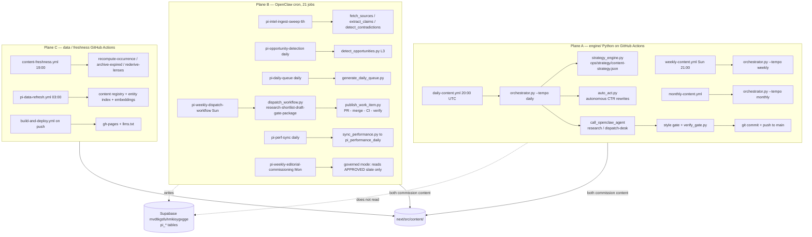
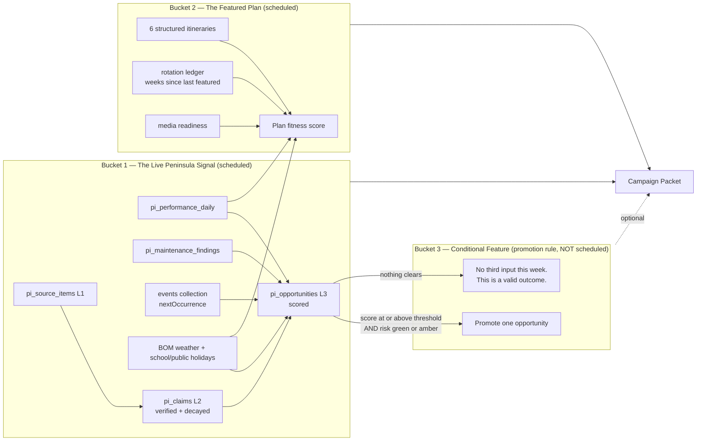
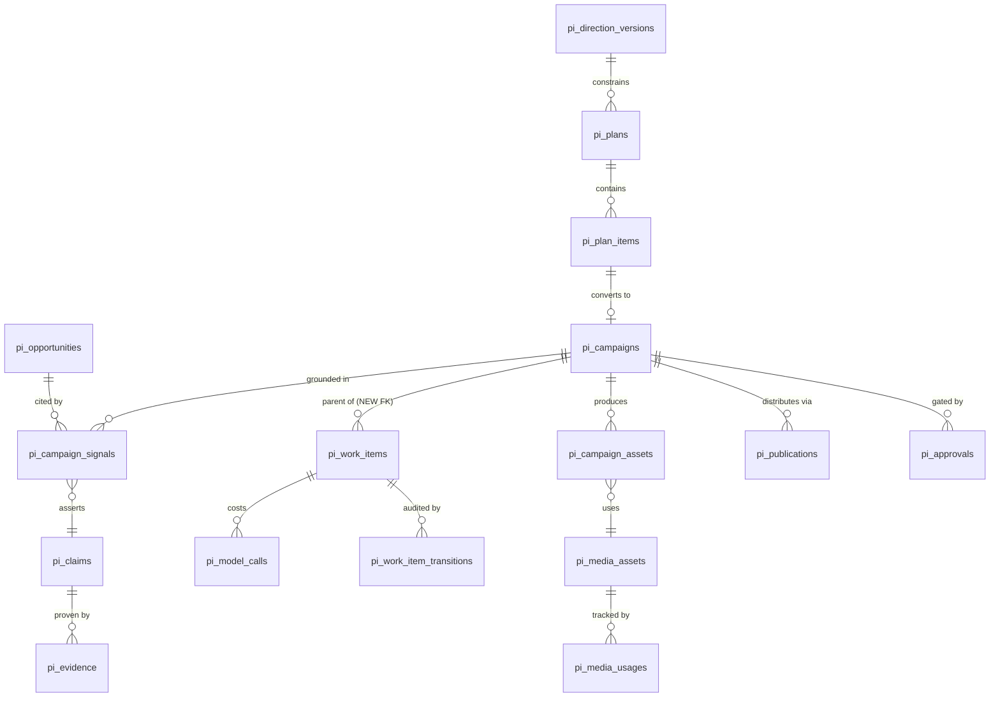
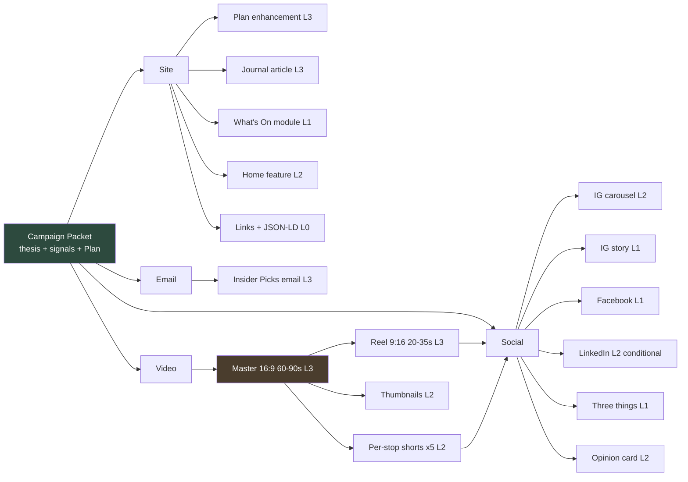
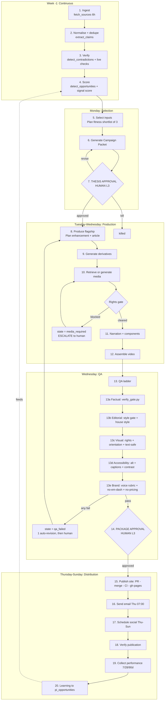
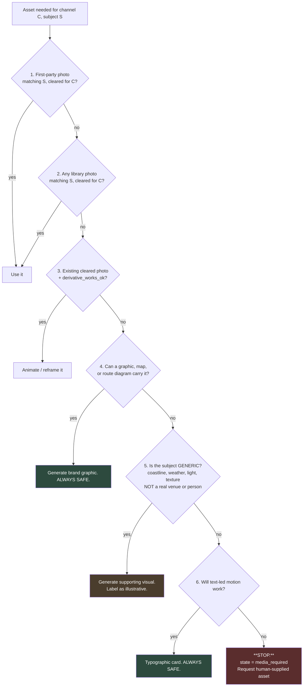
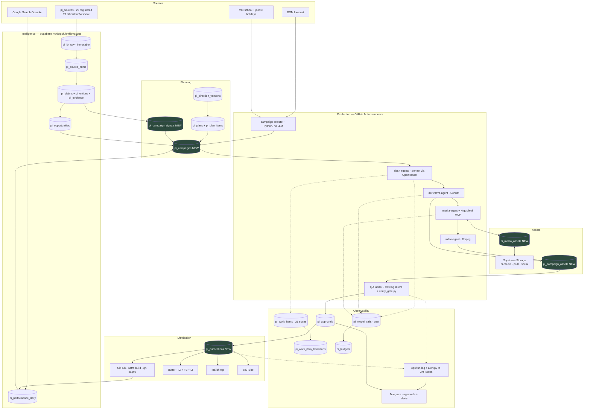
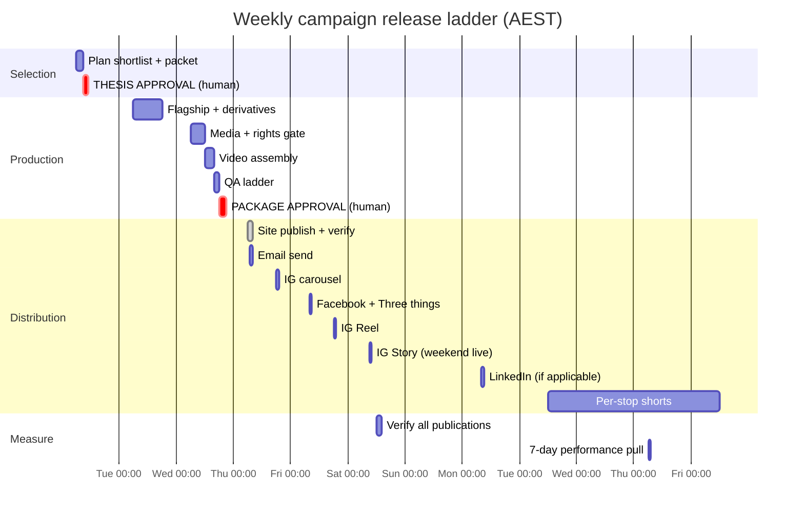
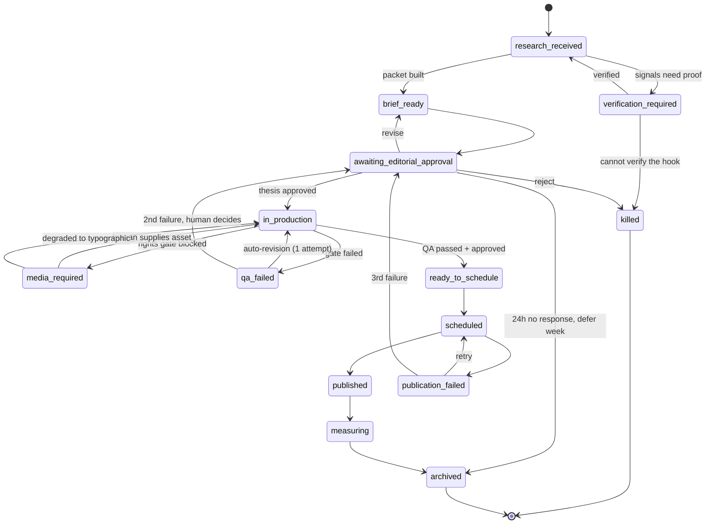

# Peninsula Insider — Content Operating System and Production Supply Chain

**Version:** 1.0
**Date:** 2026-07-28
**Status:** Proposed. Not yet approved, not yet built.
**Author:** Strategy pass, grounded in a direct audit of `richmondjw/peninsula-insider`, the OpenClaw cron registry, and the PI_Concierge Supabase project (`mvdtkgsfuhmkioygxgge`).
**Supersedes in part:** `docs/agentic-content-engine-architecture-2026-06-29.md` (section 1 "no human approvals in the publish path" is contradicted by the governed-mode cron jobs shipped in July 2026), `ops/editorial-jobs.json` (self-declared design document, not an inventory).

---

## 1. Executive recommendation

**Build one thing first: the Featured Plan campaign, running once a week, with two inputs and a database-backed campaign packet. Everything else in this document is downstream of proving that.**

The audit produced one finding that should reshape the plan you asked for. Peninsula Insider does not need a content operating system built from scratch. **It already has roughly 70% of one, spread across three production planes that do not know about each other.** The Supabase project already contains a 21-state editorial work-item machine with transition-only writes, an append-only LLM cost ledger, a budget table with alert ladders, an approvals table, a planning spine (direction → plan → plan item → work item), and a four-layer intelligence pipeline (L0 raw → L1 items → L2 claims/entities → L3 scored opportunities) with an evidence table that structurally forbids PI's own content from being used as evidence for PI's own claims. That is a serious piece of infrastructure and most publications this size have nothing like it.

What is missing is not plumbing. It is three specific things:

1. **A campaign object.** Every existing structure models *one asset*. Nothing models *one story expressed across six channels*. The `pi_work_items` state machine is per-asset and correct; there is no parent that says "these seven assets are one campaign, they share a thesis, a fact base, a media set, and a measurement window."
2. **A media rights layer.** The image schema captures `src`, `alt`, `credit`, `license` and nothing else. Three of the ten licence values are `tmp-*` prefixed, meaning temporary and uncleared. The hero image on the Peninsula Golf Weekend plan is `license: "tmp-wikimedia"` with `credit: "Peninsula Insider"` — an attribution that does not match its licence. You cannot safely automate media production on top of that. There is no expiry, no permitted-channels field, no generation provenance, and no way for a machine to answer "may I put this in a Reel?"
3. **A derivative engine.** Content is produced once and published once. The Buffer integration is documented, tested, and has live channel IDs, but the `social/` directory it reads from does not exist in the repository. Social output is currently dormant. Video output does not exist.

**The recommendation is therefore a consolidation-first roadmap, not a greenfield build.** Phase 1 retires the duplicate planes and introduces the campaign packet as a thin parent over the existing work-item machine. Phase 2 automates the derivative fan-out. Phase 3 adds generative media behind a hard rights gate. Phase 4 adds distribution and the minimum Mission Control surface.

**Weekly inputs: two, not three.** The live Peninsula signal and one Featured Plan. The third bucket (editorial or local-intelligence feature) should not be a scheduled input. It should be a *promotion rule* on the existing `pi_opportunities` table: when a scored opportunity clears a threshold, it is added to the week; when nothing clears, the week runs on two inputs and costs nothing extra. Scheduling a third input guarantees you will manufacture a story in a thin week, which is precisely the failure mode an opinionated local publication cannot afford.

**Core editorial asset: the Featured Plan, brought to life.** Not a combined "Insider Edition," and not the newsletter. The freshness layer already works and ships daily and weekly without help. The authority layer has no production system at all. Put the weekly campaign machinery entirely behind the Plan, and let the existing dispatch and Picks surfaces carry it.

**Smallest viable version to build first** is stated precisely in section 20. In one line: a `pi_campaigns` table, a Featured Plan selector, a JSON campaign packet, five hand-approved derivatives, and no generative media whatsoever for the first six weeks.

---

## 2. Current-state repository and workflow audit

### 2.1 What the repository actually is

`peninsulainsider.com.au` is an Astro site whose **source lives in `next/src/`** and whose **build output is committed to the repository root** and served from GitHub Pages via a `gh-pages` branch. This inverted layout is deliberate and enforced (`.githooks/`, plus a documented pre-commit hook). It has one dangerous property recorded in prior operational memory and worth restating here: the deploy workflow's "sync dist to repo root" step **wipes everything at the repository root except a hard-coded allowlist**. Any new top-level directory introduced by this programme (for example a `social/` or `campaigns/` directory) must be added to that allowlist or auto-deploy will silently delete it. This is the single most likely way for a well-built campaign system to lose its own artefacts.

Content is an Astro Content Layer collection set under `next/src/content/`, 23 collections, roughly 1,050 entries:

| Collection | Entries | Role in this programme |
|---|---:|---|
| `articles` | 195 | Editorial. Carries the `dispatch` structured block and `planShape`. |
| `venues` | 143 | Entity spine. Plan stops resolve here. |
| `quick-notes` | 140 | Freshness. Expiring micro-notes. |
| `events` | 86 | Freshness. Feeds What's On and Picks. |
| `experiences` | 44 | Entity spine. Plan stops resolve here. |
| `places` | 37 | Geography. |
| `itineraries` | **6** | **The structured Plans. The core evergreen asset.** |
| `weekend-picks` | 5 | Curated weekend selections, event-slug + editor verdict. |
| `regions`, `tours`, `fishing-*`, `boat-*`, `species`, others | ~120 | Vertical spine. |

**The Plans layer is bimodal and this matters more than anything else in the audit.** The live `/explore/plans/` index shows roughly 23 plans. Only **six** are structured `itineraries` JSON with machine-readable `stops[]` resolving to venue and experience references. The other ~17 are `articles` with `section: "plans"` and a `planShape` enum, which are prose only. **Only the six structured itineraries can drive an automated campaign.** Everything downstream in this document (video storyboards, carousel slides, map graphics, per-stop verticals) is generated from `stops[]`. A prose plan cannot be exploded into derivatives without a human reading it.

The `itineraries` schema is, however, already far richer than the six entries use. It has `anchorStay`, `altStays`, `baseTowns`, `editorialFrame`, `costBreakdown`, `bookingChecklist[]`, `variations[]` (labelled "Rainy day", "With kids", "Luxe-up"), `skipThese`, `faq[]`, and per-stop `timeRange`, `practical`, `driveMinutesToNext`. The Golf Weekend populates almost none of them. **The single highest-leverage content act available is not writing new plans. It is completing the schema fields on the six that exist.** `variations[]` alone is a ready-made seasonal-refresh mechanism and a ready-made social series.

### 2.2 Three production planes, partially overlapping

This is the central operational problem.



**Plane A** (`engine/orchestrator.py`, 1,079 lines) is a self-contained Python content engine. Its daily tempo runs a strategy refresh, an autonomous SEO title/meta rewriter, a research call, an Insider Picks commission, a style gate, a real deterministic verify gate, and a git push. It writes to `ops/strategy/` and `.claude/newsroom/`. **It does not read or write Supabase `pi_*` tables at all.**

**Plane B** (OpenClaw cron, 21 registered jobs) drives the intelligence pipeline and the weekly dispatch. It writes exclusively to Supabase `pi_*` tables and to the vault. Its `dispatch_workflow.py` is a checkpointed, resumable, five-stage pipeline (`research → shortlist → draft → gate → package`) with per-stage state, a lock file with PID liveness check, three-provider LLM fallback (OpenRouter → Anthropic → Claude CLI), per-run cost accounting, and a **fabrication defence** that requires every named event in a draft to map back to a stage-1 candidate with a matching source URL. That is the best single piece of engineering in the estate and the correct template for everything built next.

**Plane C** handles data hygiene and deploy.

**The collision:** Planes A and B both commission editorial content into `next/src/content/` on overlapping schedules, with different quality gates, different cost ledgers, different state, and no shared lock. `ops/operating-surface.md` acknowledges this obliquely; `ops/editorial-jobs.json` opens with a self-authored warning that of the 25 jobs it describes, "only about eight exist in the live OpenClaw registry" and that `pi-daily-events-scan` "has never produced a single output file."

**Recommendation: retire Plane A's commissioning role, keep its parts.** Specifically:

| Plane A component | Disposition | Why |
|---|---|---|
| `engine/verify_gate.py` | **Reuse, promote to shared gate** | Real, deterministic, stdlib-only, catches referential integrity, day-of-week errors, dead sections, event grounding, unbalanced code fences, and rotation repeats. Best-in-estate. Should gate every plane. |
| `engine/strategy_engine.py` | **Reuse, reposition as a signal producer** | Its ranked commissioning queue is genuinely useful, but it should write into `pi_opportunities` rather than into a parallel JSON file that only Plane A reads. |
| `engine/auto_act.py` | **Keep, unchanged, ring-fenced** | Autonomous CTR title/meta rewrites are safe, capped, idempotent, and measured. This is autonomy earned correctly. Do not touch it. |
| `engine/alert.py` | **Reuse as the shared alert path** | Opens a deduplicated GitHub issue on failure. This is the only non-silent alert path in the estate. Wire every plane into it. |
| `orchestrator.run_daily` Insider Picks commission | **Consolidate into Plane B** | Duplicate commissioning authority. |
| `orchestrator.run_weekly` slate/newsletter/SEO piece | **Retire** | Superseded by `pi-weekly-editorial-commissioning` in governed mode, which reads an approved `pi_plans` slate and explicitly forbids commissioning off-slate. That is the better governance model. |
| `orchestrator.run_monthly` | **Retire or fold into the campaign engine** | Deep seasonal research belongs to the Plan-selection input, not a separate tempo. |
| `ops/editorial-jobs.json` | **Delete** | It is a design document masquerading as config and it has already caused confusion. `ops/operating-surface.md` is the correct artefact. |

### 2.3 The Supabase workflow spine — already built

This is the good news and the reason the roadmap is short.

| Table | Rows | What it already gives this programme |
|---|---:|---|
| `pi_sources` | 22 | Tiered (T1 official → T4 social), credibility-scored, health-monitored, lifecycle-managed source registry. |
| `pi_l0_raw` | 433 | Immutable content-addressed raw fetches. UPDATE forbidden by trigger. **Every citation resolves here.** |
| `pi_source_items` | 629 | L1 normalised items, clustered for dedupe and syndication detection. |
| `pi_entities` | 410 | L2 entity registry whose `canonical_slug` aligns with the CMS content registry. |
| `pi_claims` | 103 | L2 declarative claims with a verification lifecycle and **freshness decay** (`decay_days`, `next_verify_due`). |
| `pi_evidence` | 49 | Claim → L0 links, with `source_kind <> 'pi-own'` enforced. PI can never cite itself as evidence. |
| `pi_opportunities` | 16 | L3/L4 boundary. Scored story opportunities. **"The only editorial artefact ingestion may create."** |
| `pi_performance_daily` | 849 | Nightly per-URL GSC sync, unique on `(url, date, source)`. |
| `pi_search_opportunities` | 0 | Materialised nightly search rules. **Empty — built but not producing.** |
| `pi_maintenance_findings` | 29 | Materialised nightly maintenance rules. |
| `pi_direction_versions` | 1 | Append-only editorial direction. Agents consume only the latest approved version. |
| `pi_plans` / `pi_plan_items` | 8 / 18 | Weekly/monthly slates. At most one approved plan per `(horizon, period)`. Per-card approve/kill/defer. |
| `pi_work_items` | **1** | 21-state machine. State changes **only** via `pi_transition_work_item()` behind a GUC-guarded trigger. |
| `pi_work_item_transitions` | 9 | Append-only transition log with actor, reason, approval, correlation id. |
| `pi_model_calls` | **0** | Append-only per-invocation cost ledger. **Built, never written to.** |
| `pi_budgets` | 2 | Monthly and per-piece USD caps with an alert ladder. |
| `pi_approvals` | 8 | Human decision requests. Types: publish, schedule, strategic, automation, exception. |

The `pi_work_items` state enum is already the observability state model this brief asks for:

`detected → opportunity → considered → commissioned → research → fact_check → drafting → structural_edit → copy_edit → ready_for_approval → approved → scheduled → published → monitoring`, plus `refresh_proposed`, `correction_proposed`, `archived`, `revision_required`, `blocked`, `escalated`, `killed`.

**Do not invent a new state model.** Extend this one. Sections 6 and 16 do exactly that.

**Two significant gaps in an otherwise complete spine:**

- `pi_model_calls` has **zero rows**. The cost ledger exists and nothing writes to it. `dispatch_workflow.py` tracks cost per run in a local JSON state file instead. Wiring the existing cost accounting into the existing ledger is a one-day job and unlocks the entire cost-per-campaign measure in section 17.
- `pi_work_items` has **one row**. The state machine is real, the transition RPC is real, `publish_work_item.py` correctly refuses to run unless state is `approved` or `scheduled` — but essentially nothing flows through it yet. The daily Picks and the accuracy autofix bypass it entirely and commit straight to git.

### 2.4 Verification and publishing gates

Three independent gate systems exist. They should be unified into one gate ladder (section 8).

1. **`engine/verify_gate.py`** — hard fails on: a venue/experience slug referenced in frontmatter that does not exist; a stated day-of-week that does not match the next real occurrence of that date; an internal link whose top-level section does not exist. Flags but does not block: links not yet in the sitemap, stated prices, "booking essential", opening hours. Explicitly out of scope: anything needing network.
2. **`dispatch_workflow.py` stage `gate`** — deterministic style gate plus the fabrication defence (every claim's `candidate_id` must exist in stage-1 output and its `source_url` must match).
3. **Build-time linters** — `lint-house-style.mjs` (the no-em-dash rule from `BRAND-PI.md`, auto-fixed by a pre-commit hook), `lint-no-pricing.mjs` (pricing in content hard-fails the build and blocks every subsequent deploy — the orchestrator explicitly aborts a publish rather than risk this), `lint-content-caps.mjs`, `lint-region-images.mjs`, `check-editable-coverage.mjs`, `taxonomy-lint.mjs`, `governance-lint.mjs`.

The linter layer is strong. The house-style and no-pricing rules being *build-blocking* is the right design and must be preserved for every generated derivative, including social captions and video narration.

### 2.5 Media handling — the weakest layer

The entire image contract is:

```ts
const imageRef = z.object({
  src: z.string(),
  alt: z.string(),
  credit: z.string(),                                  // "jem" sentinel = shot by James and Emma
  license: imageLicense.default('venue-media-kit'),
  caption: z.string().optional(),
});
```

with a ten-value licence enum: `original-commissioned`, `venue-media-kit`, `visit-victoria`, `wikimedia-cc0`, `wikimedia-cc-by`, `wikimedia-cc-by-sa`, `tmp-unsplash`, `tmp-wikimedia`, `tmp-pexels`, `other-licensed`.

Three values are `tmp-` prefixed. There is no field recording what "tmp" resolves to, when it expires, or who is responsible for clearing it. `next/scripts/build-media-registry.mjs` produces a filesystem-derived `media-registry.json` mapping image paths to referencing entities, and the CMS joins `cms_image_slots` in the browser. `ops/image-approvals/` holds a human review trail (shortlists, decisions, rejections, retros, an `index.csv`).

**The Golf Weekend hero is `/images/sourced/place-cape-schanck-01.webp` with `credit: "Peninsula Insider"` and `license: "tmp-wikimedia"`.** Credit and licence disagree. Under the current schema no machine can detect that, and no machine can be told "this asset may appear on the website but not in a paid Instagram Reel." **Automated media production cannot proceed on this foundation.** Section 10 replaces it.

### 2.6 Newsletter and social

**Newsletter:** `ops/email/dispatch-weekly.html` is a template rendered by `ops/email/render-preview.mjs` from the `dispatch` frontmatter block on the most recent `peninsula-this-weekend-*.md` article. The `dispatch` block is well-designed and already structured: `editorLine`, `weather`, `lead` (title, when, where, price, who, summary, bookingLabel, bookingUrl), and per-day cards. **There is no ESP integration in the repository.** A Mailchimp skill exists at the agent layer. The list, its size, its segments, and its send history are not visible from the repository and are an open question (section 20).

**Social:** `ops/skills/social-publishing.md` is a complete, tested Buffer runbook with live channel IDs for LinkedIn, Facebook, and Instagram, a five-day weekly schedule, per-platform metadata fragments, a Supabase CDN upload path for Instagram assets, and a verification query. It reads from `social/week-of-YYYY-MM-DD/posting-manifest.json`. **That directory does not exist in the repository.** Either it was never committed or it was removed by the deploy allowlist. Social output is currently dormant, and the most likely cause is the allowlist trap described in 2.1.

### 2.7 Observability

`ops/run-log-standard.md` defines a good JSON run-log shape (`runId`, `jobName`, `jobSource`, timestamps, `status`, `mutation`, `surfaces[]`, `counts{}`, `alertSent`, `artifacts[]`, `ledgerEntries[]`, `errorSummary`). `ops/publication-ledger/` records publish events. `ops/run-log/` has a schema, templates, and an index.

`ops/operating-surface.md` is honest to the point of being uncomfortable, and is the most valuable operational document in the repository. Its own summary: of the ten Tier-1 daily mutating-publish-path jobs, **five run autonomously without external review and nine of ten have an alert path of `silent`.** It flags this as "the highest-priority observability gap." It also records that three previously-listed `live` workflows never existed as files, meaning **no event maintenance ran at all until 2026-07-25**.

**This is the resilience finding that matters most: the estate's failure mode is not loud breakage, it is silent non-execution.** A campaign system layered on top without fixing this will inherit it. Section 16 addresses it directly and Phase 1 includes it as a gate.

---

## 3. Recommended content strategy

### 3.1 The strategic shape

Peninsula Insider is trying to be two publications at once and only one of them currently has a production system.

- **The freshness publication** answers "what is on this weekend, and is it any good?" It is served by daily Insider Picks, quick notes, the events collection, What's On, and the Sunday dispatch. It runs, it ships, and it is largely automated.
- **The authority publication** answers "how should I spend two days here?" It is served by Plans, guides, and evergreen editorial. **It has no production rhythm at all.** Six structured itineraries, mostly published in April 2026, mostly with schema fields unpopulated.

Freshness earns the visit. Authority earns the return visit, the search position, the newsletter subscription, and eventually the commercial relationship. GSC data in `ops/strategy/content-strategy.json` shows 14 clicks and 630 impressions over the sampled period at average position 15.2, with 408 pages in the sitemap and 26 not indexed. **That profile is exactly what an authority deficit looks like: enough pages, not enough of them being the definitive answer to anything.**

### 3.2 The strategy in one sentence

**Run the freshness layer as infrastructure and the authority layer as a campaign, where each week one existing Plan is chosen for its relevance to right now, given a story world, and expressed across every channel — using the freshness layer as the reason it is timely.**

The Plan is the asset. The week's signal is the hook. That inversion is the whole strategy. "The Peninsula Golf Weekend" is not a story. "The one weekend in the year when St Andrews Beach plays firm and there is nobody on it" is a story, and it is the same Plan.

### 3.3 What this buys

| Objective from the brief | How this strategy serves it |
|---|---|
| Remain visibly current | Freshness layer unchanged and untouched. It already works. |
| Build long-term brand and search authority | Every week, one evergreen Plan gets new media, new internal links, a refreshed `lastVerified`, and a fresh set of inbound social and email links. Compounding, not disposable. |
| Bring existing Plans to life | The Plan *is* the campaign. Video, narration, maps, carousels all derive from `stops[]`. |
| Multiple channel-ready derivatives that do not feel repurposed | Section 7 assigns each channel a different *job* against the same story world, not a different crop of the same caption. |
| Maintain local, definitive, selective, opinionated voice | The opinion lives in `editorNote`, `editorVerdict`, and `skipThese` — fields that already exist and are already human-written. Derivatives quote them; they do not invent new opinion. |
| Reduce manual production, preserve human judgement | Human judgement concentrates at two points: Plan selection and thesis approval. Everything after is production. |
| Feed approved content into a scheduling platform | Buffer for social (proven), Mailchimp for email, git for site. Coordinated, staggered, not simultaneous. |
| Foundations for Mission Control | The campaign packet and the extended state model *are* the Mission Control data layer. The dashboard is a view over them. |

### 3.4 What this strategy explicitly declines to do

- It does not add publishing volume. Six structured Plans cycled every six weeks with genuinely new treatment beats twenty thin new Plans.
- It does not make the newsletter the anchor. The newsletter is the highest-value derivative and the first to ship each week, but it is a derivative.
- It does not put generative video on the critical path. Phase 3 is explicitly gated behind Phase 2 acceptance, and a campaign must be able to complete with zero generated assets.
- It does not build a dashboard before the workflow it would display.

---

## 4. Recommended weekly input buckets

### 4.1 Two scheduled inputs, one conditional



### 4.2 Bucket 1 — the live Peninsula signal

**Reuse entirely. Change nothing about ingestion.** The L0→L3 pipeline already fetches, hashes, archives, extracts, deduplicates, clusters, and scores. `pi-intel-ingest-sweep` runs every six hours; `pi-opportunity-detection` runs daily with a hard cap of 25 LLM calls.

**What to add: a signal grouping and scoring pass tuned for campaign use.** The existing `detect_opportunities.py` scores for *story* value. The campaign needs a second, cheaper, deterministic pass that answers a different question: *which of this week's signals make which Plan timely?*

**Signal scoring model (deterministic, no LLM):**

```
signal_score =
    0.30 * recency        # days until the thing happens, inverted, 0 outside a 14-day window
  + 0.25 * verification   # 1.0 = pi_claims verified with T1/T2 evidence, 0.5 = T3, 0.2 = unverified
  + 0.20 * plan_affinity  # Jaccard overlap of signal entities against the entity set of each Plan's stops
  + 0.15 * scarcity       # 1.0 if this signal is not already covered on the site (checks pi_entities usage)
  + 0.10 * commercial     # 1.0 if it touches an anchorStay, a bookable experience, or a partner
```

`plan_affinity` is the load-bearing term and it is why the two buckets are not independent. A signal about Montalto scores high against the Golf Weekend because Montalto is stop 4. This is computable directly from `itineraries[].stops[].venue` and `pi_entities.canonical_slug`, both of which already exist.

**Verification is a gate, not a score input, for anything that will be published:**

| Claim type | Gate |
|---|---|
| Event date, time, venue | Must resolve to a `pi_claims` row with `pi_evidence` pointing at a T1 or T2 `pi_l0_raw` record. No exceptions. |
| Opening, closure, ownership change | Two independent sources or one T1. Otherwise `escalated`. |
| Booking availability | Live check at package time, timestamped, never asserted more than 24 hours old. |
| Price | **Never published.** `lint-no-pricing.mjs` blocks the build. Use "booking required" or "ticketed" instead. |
| Weather | Attributed to BOM, expressed as a window not a fact ("rain likely Saturday afternoon"). |

**Grouping:** signals cluster on `(entity, week, kind)`. A cluster becomes a *candidate angle*, never a story on its own. Angles are what the commissioning step chooses between.

### 4.3 Bucket 2 — the Featured Plan

**Selection is a deterministic score, presented to a human as a ranked shortlist of three.** The human picks. That is the first of two approval points.

```
plan_fitness =
    0.25 * seasonal_fit      # from itinerary.season and current month
  + 0.20 * weather_fit       # 7-day BOM outlook vs the plan's outdoor/indoor stop ratio
  + 0.15 * signal_lift       # max plan_affinity across this week's signals
  + 0.15 * search_headroom   # impressions with position 8-25 on plan-related queries (pi_performance_daily)
  + 0.10 * freshness_debt    # weeks since last featured, capped at 8; a plan featured <4 weeks ago scores 0
  + 0.10 * media_readiness   # share of stops with a rights-cleared, channel-permitted asset
  + 0.05 * commercial_pull   # anchorStay present and bookable
```

`freshness_debt` with a hard zero inside four weeks is the rotation guard. The repository already has a precedent for this: commit `ff0a1ce45a` added a "rotation ledger to stop Insider Picks repeating itself", and `verify_gate.check_rotation()` implements it. **Reuse that mechanism, do not build a second one.**

`media_readiness` is deliberately a *selection* input, not just a production input. A plan with no cleared media should lose to one with cleared media, because the alternative is the system generating imagery to cover a rights gap, which is exactly the behaviour section 10 forbids.

**Selection inputs by name, mapped to sources:**

| Input | Source | Automated? |
|---|---|---|
| Season | `itineraries[].season` + system date | Yes |
| Weather | BOM 7-day forecast for Mornington Peninsula | Yes |
| School holidays | Victorian DE term dates, static annual table | Yes |
| Public holidays | Victorian public holiday table, static annual | Yes |
| Audience demand | `pi_performance_daily` query-level impressions | Yes |
| Cultural moments | `pi_opportunities` + `signature-events` collection | Yes |
| Current events | Bucket 1 clusters | Yes |
| Search opportunity | `pi_search_opportunities` (**currently empty — must be made to produce**) | Blocked |
| Commercial potential | `itineraries[].anchorStay` + partner register | Partial |
| Content freshness | Rotation ledger + `lastVerified` | Yes |
| Available visual material | New `pi_media_assets` (section 10) | Blocked until Phase 1 |

Two inputs are blocked on work this programme must do anyway. That is the correct dependency ordering.

### 4.4 Bucket 3 — conditional, not scheduled

**Recommendation: do not run a third input on a schedule. Promote one when it earns promotion.**

Promotion rule: a `pi_opportunities` row is promoted into the week when **all** of:

- `scores_json.total >= 0.70` on the current rubric version, and
- `risk_class` is `green` or `amber` (never `red` without an explicit `pi_approvals` row of type `strategic`), and
- it is not already expressible as an angle on the Featured Plan, and
- the week's campaign is not already at its cost cap (`pi_budgets`).

Expected promotion rate on a Peninsula-sized beat: **roughly one week in three.** When nothing clears, the week runs on two inputs. Say so in the run log. A week with no third input is a signal about the beat, not a failure of the system.

The kinds of feature worth promoting, in descending order of strategic value for PI specifically:

1. **"What changed"** — a closure, an opening, an ownership change, a booking-window shift. Highest usefulness, highest scarcity, lowest production cost, hardest for competitors to copy because it requires actually watching.
2. **A strong local opinion** — the archetype PI's brand operating system calls The Local. Expensive in judgement, cheap in production, highest brand value.
3. **A commercially valuable theme** (stays, weddings, retreats, wellness, golf) — only when a real signal supports it. Never on a schedule, or the publication starts to read as an advertorial engine.
4. **A seasonal explainer or practical planning question** — good evergreen, but this is usually better expressed as a `variations[]` entry on an existing Plan than as a new article.

---

## 5. Core editorial asset recommendation

### 5.1 The four models compared

| Model | What ships weekly | Strengths | Fatal weakness for PI |
|---|---|---|---|
| **A. One flagship weekly story** | One big piece | Clear, prestigious, easy to brief | PI's beat cannot reliably produce a flagship-worthy story 52 weeks a year. Thin weeks force manufactured significance, which is exactly what destroys an opinionated local publication's credibility. |
| **B. One seasonal Plan brought to life** | One Plan campaign | Compounding asset value, evergreen SEO, perfectly matched to the derivative tree, six-week natural rotation | On its own, reads as static. Needs a reason it is *this week*. |
| **C. One combined Insider Edition** | Picks + Plan + intelligence in one package | Single approval, single send, coherent reader experience | Couples freshness to authority. A dull events week drags the whole edition down, and a Plan campaign gets delayed by an unrelated fact-check. Single point of failure. |
| **D. Separate freshness and evergreen campaigns** | Two independent tracks | Decoupled failure domains, each optimised | Doubles the approval and QA load on a one-person editorial operation. |

### 5.2 Recommendation: B, with the freshness layer supplying the hook

**The editorial core asset is the Featured Plan campaign. The live signal is not a co-equal input; it is the reason this Plan is this week's.**

Concretely, each week produces:

- **One campaign thesis** — one or two sentences that say why this Plan matters right now. This is the only thing James approves at the start of the week, and everything downstream inherits it. Example, generated from real Golf Weekend data: *"Late July is the only stretch of the year when St Andrews Beach plays firm, the tee sheet is open inside a fortnight, and Montalto will seat a group of six at short notice. If you have been putting off the golf weekend, this is the window."*
- **One enhanced Plan page** — the campaign's canonical home. New media, completed schema fields, refreshed `lastVerified`, one new `variations[]` entry, embedded video when Phase 3 is live.
- **One supporting journal article** — the story-world piece. Opinionated, 700 to 1,100 words, links into the Plan.
- **One newsletter** — leads with the campaign, carries the Picks.
- **Six to eight social derivatives** — channel-specific (section 7).
- **One video** from Phase 3 onward.

**The freshness layer continues to run untouched on its existing cadence**, and appears inside the campaign's derivatives as the "what's on" module. It is not gated on campaign approval. If the campaign fails, Picks and the dispatch still ship. **That decoupling is what makes model B survivable where model C is not.**

### 5.3 Why the newsletter is not the anchor

Three reasons, in order of weight:

1. **An anchor must be the thing that survives when other things fail.** The newsletter is the most dependent artefact in the system: it needs the Plan, the Picks, the media, and a working ESP. It is the *last* thing that can be produced, not the first.
2. **The newsletter has no permanent URL and no search value.** The Plan compounds; the email is consumed once.
3. **It is nonetheless the single most valuable derivative** and should be the first to ship each week (section 13's staggered release puts it on Thursday, ahead of the weekend). Highest value and anchor are different roles.

---

## 6. Canonical Content Campaign Packet and proposed schema

### 6.1 Design principle

**The packet is a parent over `pi_work_items`, not a replacement for it.** A campaign spans several assets; the existing 21-state machine correctly models one asset. Adding a parent preserves the transition trigger, the transition log, the cost ledger FK, and the approvals table, all of which already work.



### 6.2 The three-zone rule

Every field in the packet is tagged as exactly one of:

| Zone | Meaning | Mutability | Who writes it |
|---|---|---|---|
| **`fact`** | Verified source material. Must resolve to `pi_claims` → `pi_evidence` → `pi_l0_raw`. | Immutable once verified. Corrections create a new claim, never an edit. | Ingestion + verification agents |
| **`judgement`** | Editorial decision. Thesis, angle, verdict, selection, ordering, what to skip. | Human-authored or human-approved. Machines may draft, never finalise. | Human, or agent with a `pi_approvals` row |
| **`generated`** | Channel copy and media derived from `fact` + `judgement`. | Freely regenerable. Never a source of truth. | Production agents |

**The rule that makes this work: a `generated` field may never introduce a proposition that is not traceable to a `fact` or a `judgement` field.** This is `dispatch_workflow.py`'s fabrication defence generalised from events to every claim in every derivative, and it is the single most important governance mechanism in this design.

### 6.3 Proposed SQL schema

```sql
-- ─────────────────────────────────────────────────────────────────────────
-- pi_campaigns — the canonical Content Campaign Packet
-- ─────────────────────────────────────────────────────────────────────────
create table public.pi_campaigns (
  id                    uuid primary key default gen_random_uuid(),
  campaign_key          text not null unique,          -- 'CMP-2026-W31-golf-weekend'
  publication_week      text not null,                 -- ISO week '2026-W31'

  -- ── Provenance ──────────────────────────────────────────────────────────
  direction_version_id  uuid not null references pi_direction_versions(id),
  plan_id               uuid references pi_plans(id),
  plan_item_id          uuid references pi_plan_items(id),

  -- ── Zone: JUDGEMENT (human-approved) ────────────────────────────────────
  strategic_theme       text not null,                 -- 'winter-authority'
  editorial_thesis      text not null,                 -- the one-or-two-sentence why-now
  core_promise          text not null,                 -- what the reader can do after reading
  audience              text not null
    check (audience in ('couples','families','friends','solo','locals','first-timers','planners')),
  angle_rationale       text,                          -- why this angle over the runners-up
  thesis_approved_by    text,
  thesis_approved_at    timestamptz,

  -- ── Zone: FACT (verified) ───────────────────────────────────────────────
  featured_plan_slug    text not null,                 -- FK-by-slug to itineraries collection
  plan_fitness_json     jsonb not null default '{}',   -- the score breakdown from 4.3
  seasonal_context      jsonb not null default '{}',   -- {season, weather_window, holidays[], daylight}
  confidence            numeric check (confidence between 0 and 1),

  -- ── Production control ──────────────────────────────────────────────────
  state                 text not null default 'research_received',
  risk_class            text not null default 'green'
    check (risk_class in ('green','amber','red')),
  est_cost_usd          numeric check (est_cost_usd >= 0),
  actual_cost_usd       numeric check (actual_cost_usd >= 0),
  blocked_reason        text,
  utm_campaign          text not null,                 -- 'pi-2026-w31-golf'
  correlation_id        uuid not null default gen_random_uuid(),

  -- ── Zone: GENERATED (post-hoc) ──────────────────────────────────────────
  learning_notes        text,

  created_at            timestamptz not null default now(),
  updated_at            timestamptz not null default now(),

  constraint pi_campaigns_state_chk check (state in (
    'research_received','verification_required','brief_ready','awaiting_editorial_approval',
    'in_production','media_required','qa_failed','ready_to_schedule','scheduled',
    'published','publication_failed','measuring','archived','killed'
  )),
  constraint pi_campaigns_blocked_chk check (
    (state <> 'media_required' and state <> 'qa_failed') or blocked_reason is not null),
  constraint pi_campaigns_thesis_approval_chk check (
    state in ('research_received','verification_required','brief_ready','awaiting_editorial_approval','killed')
    or thesis_approved_at is not null)
);

comment on table public.pi_campaigns is
  'PI Campaign: one week, one thesis, one Featured Plan. Parent of pi_work_items.
   Zone discipline: strategic_theme/editorial_thesis/core_promise/angle_rationale are
   JUDGEMENT and require human approval; featured_plan_slug/seasonal_context/
   plan_fitness_json are FACT; learning_notes is GENERATED.';

-- ─────────────────────────────────────────────────────────────────────────
-- pi_campaign_signals — the fact base. Every downstream claim resolves here.
-- ─────────────────────────────────────────────────────────────────────────
create table public.pi_campaign_signals (
  id               uuid primary key default gen_random_uuid(),
  campaign_id      uuid not null references pi_campaigns(id) on delete cascade,
  claim_id         uuid references pi_claims(id),          -- null only for role='context'
  opportunity_id   uuid references pi_opportunities(id),
  role             text not null
    check (role in ('hook','support','timing','context','commercial','risk')),
  assertion        text not null,                          -- the fact, in plain words
  entity_slug      text,                                   -- pi_entities.canonical_slug
  verification     text not null default 'unverified'
    check (verification in ('verified','single_source','unverified','contradicted','expired')),
  source_tier      smallint check (source_tier between 1 and 4),
  verified_at      timestamptz,
  expires_at       timestamptz,                            -- from pi_claims.decay_days
  created_at       timestamptz not null default now(),

  -- A hook or timing signal may never be unverified. This is the hard gate.
  constraint pi_campaign_signals_gate_chk check (
    role not in ('hook','timing') or verification in ('verified','single_source'))
);

-- ─────────────────────────────────────────────────────────────────────────
-- pi_campaign_assets — one row per channel deliverable
-- ─────────────────────────────────────────────────────────────────────────
create table public.pi_campaign_assets (
  id               uuid primary key default gen_random_uuid(),
  campaign_id      uuid not null references pi_campaigns(id) on delete cascade,
  work_item_id     uuid references pi_work_items(id),      -- reuses the 21-state machine
  channel          text not null check (channel in (
                     'site_plan','site_article','site_whats_on','site_home',
                     'email','ig_carousel','ig_reel','ig_story','facebook','linkedin',
                     'video_master','video_short','thumbnail')),
  variant          text,                                    -- '9:16', '4:5', '1:1', '1.91:1'
  purpose          text not null,                           -- from the derivative matrix
  body_md          text,                                    -- GENERATED
  cta_label        text,
  cta_url          text,                                    -- must carry utm_campaign
  media_asset_ids  uuid[] not null default '{}',
  approval_level   text not null default 'L2'
    check (approval_level in ('L0','L1','L2','L3')),
  qa_json          jsonb not null default '{}',             -- per-gate results
  state            text not null default 'draft'
    check (state in ('draft','qa_failed','ready','scheduled','published','failed','cancelled')),
  scheduled_for    timestamptz,
  published_at     timestamptz,
  platform_post_id text,
  published_url    text,
  lifespan_days    smallint,                                -- expected useful life
  created_at       timestamptz not null default now(),
  updated_at       timestamptz not null default now()
);

-- ─────────────────────────────────────────────────────────────────────────
-- pi_publications — the scheduling and verification queue
-- ─────────────────────────────────────────────────────────────────────────
create table public.pi_publications (
  id                uuid primary key default gen_random_uuid(),
  campaign_asset_id uuid not null references pi_campaign_assets(id) on delete cascade,
  platform          text not null
    check (platform in ('buffer','mailchimp','github','youtube','manual')),
  scheduled_for     timestamptz not null,
  submitted_at      timestamptz,
  external_id       text,                                   -- Buffer post id, MC campaign id, commit sha
  verified_at       timestamptz,                            -- post-publish live check passed
  verification_note text,
  attempt_count     smallint not null default 0,
  last_error        text,
  state             text not null default 'queued'
    check (state in ('queued','submitted','published','verify_failed','failed','cancelled')),
  created_at        timestamptz not null default now()
);
```

### 6.4 Example record — Golf Weekend, week 31

```json
{
  "campaign_key": "CMP-2026-W31-golf-weekend",
  "publication_week": "2026-W31",
  "direction_version_id": "…",
  "plan_item_id": "…",

  "_zone_judgement": {
    "strategic_theme": "winter-authority",
    "editorial_thesis": "Late July is the only stretch of the year when St Andrews Beach plays firm, the tee sheet opens inside a fortnight, and the Peninsula's best group lunch will still seat six at short notice. If you have been putting off the golf weekend, this is the window.",
    "core_promise": "Book one round and one lunch this week, and the rest of the weekend arranges itself around them.",
    "audience": "friends",
    "angle_rationale": "Beat the September school-holiday tee-sheet crush. Runner-up angle (Doak architecture explainer) held for a monthly piece: too specialist for a weekly hook.",
    "thesis_approved_by": "james",
    "thesis_approved_at": "2026-07-28T09:14:00+10:00"
  },

  "_zone_fact": {
    "featured_plan_slug": "the-peninsula-golf-weekend",
    "plan_fitness_json": {
      "seasonal_fit": 0.70, "weather_fit": 0.85, "signal_lift": 0.62,
      "search_headroom": 0.55, "freshness_debt": 1.00,
      "media_readiness": 0.29, "commercial_pull": 1.00, "total": 0.71,
      "runners_up": ["wellness-weekend 0.68", "sorrento-off-season-weekend 0.61"]
    },
    "seasonal_context": {
      "season": "winter",
      "weather_window": "cold, clearing Saturday, firm ground after Tuesday's storm",
      "holidays": [],
      "next_school_holidays": "2026-09-19",
      "daylight": "sunset 17:23 AEST"
    },
    "confidence": 0.78
  },

  "risk_class": "amber",
  "risk_note": "media_readiness 0.29 — only 2 of 7 stops have a rights-cleared asset. Hero image licence is tmp-wikimedia with a mismatched credit and must be replaced or cleared before any paid or social use.",

  "state": "media_required",
  "blocked_reason": "5 of 7 stops lack a channel-permitted media asset",
  "utm_campaign": "pi-2026-w31-golf",
  "est_cost_usd": 4.20
}
```

```json
{
  "_table": "pi_campaign_signals",
  "rows": [
    {
      "role": "hook", "entity_slug": "st-andrews-beach-golf-course",
      "assertion": "Public tee times available inside 14 days across the last three weekends.",
      "verification": "verified", "source_tier": 1,
      "claim_id": "…", "verified_at": "2026-07-28T06:02:00Z", "expires_at": "2026-08-04T06:02:00Z"
    },
    {
      "role": "timing", "entity_slug": null,
      "assertion": "Victorian school holidays begin 19 September; tee-sheet pressure rises from mid-September.",
      "verification": "verified", "source_tier": 1
    },
    {
      "role": "support", "entity_slug": "montalto",
      "assertion": "Piazza service operates without a dress code and accepts walk-in groups outside peak.",
      "verification": "single_source", "source_tier": 2
    },
    {
      "role": "risk", "entity_slug": "bushrangers-bay-walk",
      "assertion": "Parks Victoria track condition after 28 July storm not yet re-confirmed.",
      "verification": "unverified", "source_tier": 3
    },
    {
      "role": "commercial", "entity_slug": "jackalope",
      "assertion": "Anchor stay, direct booking link live, 15 minutes from first tee.",
      "verification": "verified", "source_tier": 1
    }
  ]
}
```

Note what the schema does here without anyone having to remember a rule: the `risk` signal about Bushrangers Bay is `unverified`, so the `pi_campaign_signals_gate_chk` constraint would have rejected it as a `hook` or `timing` role. It is allowed as `risk`, and section 8's QA stage will strip any derivative sentence that asserts the track is open.

---

## 7. Derivative-content matrix

### 7.1 The anti-repurposing principle

Each channel gets a **different job**, not a different crop. The four jobs:

| Job | Definition | Channels |
|---|---|---|
| **Persuade** | Make someone want the weekend | IG Reel, IG carousel slide 1, video master, home feature |
| **Enable** | Make the weekend bookable | Email, Plan page, booking checklist, IG Story with link |
| **Prove** | Demonstrate PI knows things others do not | LinkedIn, journal article, "what changed", `skipThese` |
| **Remind** | Keep PI present between visits | Facebook, quick notes, per-stop shorts |

A carousel that persuades and an email that enables can share a fact base, share media, and still not read as the same asset, because they are answering different reader questions.

### 7.2 The matrix

| # | Channel / format | Job | Audience | Structure | Visual requirement | CTA | Source field(s) | Approval | Lifespan |
|---|---|---|---|---|---|---|---|---|---|
| 1 | **Plan page enhancement** | Enable | Planners in-market | Completed schema fields, new `variations[]`, embedded video, refreshed `lastVerified` | Hero + 1 per stop, all rights-cleared | Book anchor stay | `itineraries` + all signals | **L3** | 12+ months |
| 2 | **Supporting journal article** | Prove | Returning readers | 700–1,100 w. Thesis → why now → the shape of the weekend → what to skip → the Plan | Hero + 2 inline | Read the Plan | `editorial_thesis`, `angle_rationale`, `skipThese` | **L3** | 6–12 months |
| 3 | **What's On module** | Remind | Weekend deciders | 3–5 event cards, existing surface | Existing event heroes | View What's On | Bucket 1 verified events | **L1** | 7 days |
| 4 | **Homepage feature** | Persuade | All arrivals | Hero card, thesis line, Plan link | Campaign hero, 16:9 | Open the Plan | `editorial_thesis`, hero | **L2** | 7 days |
| 5 | **Internal linking + schema pass** | Enable | Search crawlers | Cross-links from every mentioned venue/place; `ItemList` JSON-LD on the Plan | None | n/a | `stops[]`, `relatedVenues` | **L0** | Permanent |
| 6 | **Insider Picks email** | Enable | Subscribers | Section 7.3 | 1 hero + 3 thumbs, email-safe | Read the Plan / Book | Everything | **L3** | 72 h |
| 7 | **IG carousel (4:5, 6–8 slides)** | Persuade | Discovery | S1 hook · S2 the shape · S3–6 one stop each · S7 what to skip · S8 CTA | 1 per slide, 4:5, cleared for social | Link in bio → Plan | `stops[].note`, `skipThese` | **L2** | 30–90 days |
| 8 | **IG Reel (9:16, 20–35 s)** | Persuade | Discovery | Hook 0–3 s · 5 stop beats · CTA. Captions burned in | Video or Ken Burns stills, 9:16 | Save this / link in bio | Video master, section 11 | **L3** | 30–90 days |
| 9 | **IG Story (3–4 frames)** | Enable | Existing followers | Frame 1 hook · 2–3 practical · 4 link sticker | 9:16, text-forward, low production | Link sticker → Plan | `bookingChecklist[]` | **L1** | 24 h |
| 10 | **Facebook post** | Remind | Local + returning | 60–90 w conversational, one clear practical detail | 1.91:1 single image | Link → Plan | `editorLine`, one stop | **L1** | 3–7 days |
| 11 | **LinkedIn post** | Prove | Operators, partners, tourism industry | 120–200 w. **Only when the week has a genuine industry angle.** Skip otherwise. | 1.91:1 or none | Link → article | `angle_rationale`, "what changed" | **L2** | 14–30 days |
| 12 | **"Three things this weekend"** | Remind | Weekend deciders | 3 items, one line each, verified only | 1 image or text card | View What's On | Bucket 1 top 3 by score | **L1** | 3 days |
| 13 | **Per-stop vertical short (9:16, 8–12 s)** | Remind | Discovery | One stop, one line of narration, one on-screen fact | Clip from video master | Link in bio | Video master segment | **L2** | 30–90 days |
| 14 | **Opinion extract card** | Prove | Brand | One quote from `editorNote` or `skipThese`, typeset | Typographic, no photo needed | Read the Plan | `editorNote`, `skipThese` | **L2** | 90+ days |
| 15 | **Video master (16:9, 60–90 s)** | Persuade | Site + YouTube | Section 11 | Full production | Watch → Plan | Campaign packet | **L3** | 12+ months |
| 16 | **Thumbnail set** | Persuade | Video surfaces | 16:9 + 9:16 + 1:1 | Frame grab + typographic overlay | n/a | Video master | **L2** | With video |

**Approval levels:** L0 mechanical/no review · L1 spot-check, auto-publish · L2 agent-approved with human sample audit · L3 human approval required, always.

**Note on 14.** The opinion extract card is the cheapest high-brand-value derivative in the matrix. It needs no photography, no rights clearance, and no generation. It is pure typography over PI's existing editorial voice. **In a media-blocked week, this is the derivative that still ships.**

### 7.3 The Insider Picks email, specified

Modular, six blocks, each independently renderable and independently suppressible:

| Block | Content | Suppressible? | Source |
|---|---|---|---|
| **A. Lead** | Campaign thesis in 2–3 sentences, hero image, one link into the Plan | No | `editorial_thesis` |
| **B. The Picks** | 3–5 items. Each: what, when, one line of editor verdict, link | No, minimum 3 | `weekend-picks` + Bucket 1 |
| **C. The Featured Plan** | Plan title, `dek`, the shape in one line, "start here" stop, CTA | No | `itineraries` |
| **D. One booking note** | The single most time-sensitive practical action this week | Yes | `bookingChecklist[]` where `windowWeeksAhead` is near |
| **E. What changed** | One closure, opening, or shift. **Omit rather than pad.** | Yes | Bucket 1 `role='risk'` / maintenance findings |
| **F. Sign-off + one link** | Editor line, single link, unsubscribe | No | Editor |

**Subject-line and preview-text generation:** produce three pairs per send, scored on specificity (does it name a place or a date?), promise (is there a verb the reader can act on?), and voice (does it pass the house-style linter and avoid the em-dash rule?). Present all three to the human; log which was chosen; after twelve sends, correlate choice and open rate and start ranking. Never auto-send an unchosen subject line.

**Segmentation, in order of value and in this order only:**
1. Engagement recency (opened in last 90 days / not) — send frequency differs, content does not.
2. Geography (Peninsula local / Melbourne / other) — locals do not need the drive framing.
3. Declared interest (golf, wine, family, wellness) — collected at signup, drives which Plan campaigns they receive as a lead vs a mention.

Do not segment further until the list is above 2,000. Below that the segments are too small to learn from.

### 7.4 Derivative tree, visualised



**Yield: one campaign packet → 16 assets, of which 5 need human approval.** That ratio is the production case for the whole programme.

---

## 8. End-to-end workflow architecture

### 8.1 The twenty stages



### 8.2 Stage specification

Columns: **Agent** · **In** · **Out** · **Trigger** · **Store** · **Tool/Model** · **Validation** · **Approval** · **Failure** · **Retry** · **Escalation** · **Audit**

| # | Stage | Agent | Input | Output | Trigger | Store | Tool | Validation | Appr. | Failure state | Retry | Escalation | Audit |
|---|---|---|---|---|---|---|---|---|---|---|---|---|---|
| 1 | Ingest | ingest-worker | `pi_sources` active | `pi_l0_raw`, `pi_source_items` | cron 6 h | Supabase + `pi-l0` bucket | `fetch_sources.py` (stdlib) | ≥50% sources OK | L0 | `source_degraded` | 1, next cycle | `failure_streak>3` → issue | `pi_sources.health_note` |
| 2 | Normalise | ingest-worker | `pi_source_items` | `pi_claims`, `pi_entities` | after 1 | Supabase | `extract_claims.py` | Entity resolves to `canonical_slug` | L0 | `extraction_failed` | 1 | 3 consecutive → issue | `pi_object_activity_log` |
| 3 | Verify | verify-agent | `pi_claims` | `pi_evidence`, verification status | after 2 | Supabase | `detect_contradictions.py` + live HTTP | `source_kind <> 'pi-own'` | L0 | `contradicted` | 0 | contradiction → `pi_maintenance_findings` | `pi_evidence` |
| 4 | Score | opportunity-agent | clusters + perf | `pi_opportunities` | daily 18:30 UTC | Supabase | `detect_opportunities.py`, cap 25 LLM calls | rubric version pinned | L0 | `scoring_failed` | 1 | OpenRouter credit exhaustion → **explicit alert** | `pi_model_calls` |
| 5 | Select | campaign-selector | itineraries + signals + perf + rotation | ranked 3 Plans | Mon 06:00 AEST | `pi_campaigns` draft | deterministic Python, **no LLM** | all 6 itineraries scored | L0 | `selection_failed` | 1 | no plan ≥0.40 → human picks | `plan_fitness_json` |
| 6 | Packet | packet-builder | selection + signals | `pi_campaigns` + `pi_campaign_signals` | after 5 | Supabase | Sonnet, thesis draft only | every `hook`/`timing` signal verified (DB constraint) | L0 | `verification_required` | 1 | 2 fails → human | `pi_model_calls` |
| **7** | **Thesis approval** | **human** | packet | approved thesis | after 6 | `pi_approvals` type `strategic` | Telegram + Asana | thesis ≤3 sentences, names a place and a window | **L3** | `awaiting_editorial_approval` | n/a | 24 h no response → campaign deferred, week runs freshness only | `pi_approvals` |
| 8 | Flagship | desk-agent | approved packet | Plan patch + article md | after 7 | git branch | Sonnet + `content_generator.py` | `verify_gate.py` PASS | L0 | `revision_required` | 1 | 2 fails → human rewrite | `pi_work_items` |
| 9 | Derivatives | derivative-agent | flagship + packet | `pi_campaign_assets` rows | after 8 | Supabase | Sonnet, one call per channel group | every proposition traces to a signal | L0 | `qa_failed` | 1 per asset | 3 assets fail → whole campaign to human | per-asset `qa_json` |
| 10 | Media | media-agent | asset media requirements | `pi_media_assets` refs | after 9 | Supabase + Storage | media search → generate ladder (§10.4) | **rights gate: `permitted_channels` must contain the target channel** | L0 | **`media_required`** | 0 | **always human. Never auto-generate to fill a rights gap.** | `pi_media_usages` |
| 11 | Narration | narration-agent | packet + stops | script + TTS wav | after 10 | Storage | Higgsfield `generate_audio` | script passes house style; ≤150 wpm | L0 | `narration_failed` | 1 | 2 fails → text-led fallback (§11.9) | `pi_model_calls` |
| 12 | Assemble | video-agent | clips + narration + captions | mp4 masters | after 11 | Storage | ffmpeg in GitHub Actions | duration ±10%, audio present, captions burned | L0 | `assembly_failed` | 1 | 2 fails → carousel-only week | run-log |
| 13 | QA | qa-agent | all assets | `qa_json` per asset | after 12 | Supabase | ladder in 8.3 | all five gates pass | L0 | `qa_failed` | 1 auto-revision | 2 fails → human | `qa_json` |
| **14** | **Package approval** | **human** | full package | go/no-go | after 13 | `pi_approvals` type `publish` | Mission Control or Telegram digest | — | **L3** | `awaiting_editorial_approval` | n/a | 12 h no response → site + email hold, social cancelled | `pi_approvals` |
| 15 | Publish site | publisher | approved assets | merged PR, live URL | after 14 | git → gh-pages | `publish_work_item.py` | state ∈ approved/scheduled (enforced) | L0 | `publication_failed` | 1 | CI red → rollback PR, alert | `pi_work_item_transitions` |
| 16 | Email | email-agent | email asset | Mailchimp campaign | Thu 07:00 AEST | Mailchimp + `pi_publications` | Mailchimp API | render check + link check + one live test send | L1 | `publication_failed` | 1 | 2 fails → human sends manually | `pi_publications.external_id` |
| 17 | Social | social-agent | social assets | Buffer posts | Thu–Sun ladder | Buffer + `pi_publications` | Buffer GraphQL (`ops/skills/social-publishing.md`) | image present for IG; UTM on every link | L1 | `publication_failed` | 2, backoff 5/30 min | 3 fails → issue + Telegram | `platform_post_id` |
| 18 | Verify pub | verify-agent | `pi_publications` | `verified_at` | +15 min each | Supabase | HTTP 200 + content match; Buffer post query | live URL contains the campaign's UTM | L0 | `verify_failed` | 2 | **verify_failed is louder than failed** | `verification_note` |
| 19 | Measure | perf-agent | URLs + post IDs | metrics | +7/28/90 d | `pi_performance_daily`, `pi_campaign_assets` | GSC + GA4 + Buffer analytics | attribution via `utm_campaign` | L0 | `measurement_gap` | daily until data | 14 d no data → flag | `pi_performance_daily` |
| 20 | Learn | learning-agent | metrics vs `plan_fitness_json` | `learning_notes`, weight update | after 19 | `pi_campaigns`, `ops/strategy/model-weights.json` | deterministic | weight change ≤10% per cycle | L2 | `learning_skipped` | n/a | 4 cycles no learning → review rubric | `pi_object_activity_log` |

### 8.3 The QA ladder

Run in this order; each gate is cheap before the one after it.

| Gate | Checks | Blocking? | Implementation |
|---|---|---|---|
| **13a Factual** | Referential integrity; day-of-week correctness; dead sections; event grounding; **every generated proposition traces to a `pi_campaign_signals` row** | **Hard** | `engine/verify_gate.py`, extended with the signal-trace check |
| **13b Editorial** | Voice rubric from the Brand Operating System; no generic travel-writing register; opinion present where opinion is promised | Soft (1 revision, then flag) | `ops/scripts/editorial-quality-check.py` |
| **13c Visual** | Rights cleared for target channel; correct aspect ratio; text-safe zones respected; no recognisable third-party branding without permission | **Hard** | New `check-media-rights.mjs` |
| **13d Accessibility** | Alt text present and descriptive; captions on all video; contrast ≥4.5:1 on typographic cards; no meaning conveyed by colour alone | **Hard** | New `check-a11y-assets.mjs` |
| **13e Brand** | No em-dashes; no pricing; taxonomy valid; content caps respected | **Hard** | `lint-house-style.mjs`, `lint-no-pricing.mjs`, `taxonomy-lint.mjs`, `lint-content-caps.mjs` |

**13e must run last and must be build-blocking**, because a pricing string in a generated caption that reaches `next/src/content/` will fail the site build and block every subsequent deploy until removed. The orchestrator already handles this correctly for articles and aborts rather than risk it; extend the same behaviour to derivatives.

---

## 9. Agent and system responsibilities

### 9.1 Roster

**Reused unchanged (7):** `research-agent`, `signal-agent`, `commissioning-agent`, `dispatch-desk`, `style-agent`, `verify-agent`, `remy-orchestrator` — all in `.claude/agents/`.

**Extended (2):**

| Agent | Change |
|---|---|
| `commissioning-agent` | Gains Plan-selection responsibility. **Governed mode only** — may propose but never commission off an unapproved slate, matching the July 2026 governance change already in `pi-weekly-editorial-commissioning`. |
| `verify-agent` | Gains the signal-trace check (13a) and the media rights check (13c). |

**New (5):**

| Agent | Responsibility | Model | Cost/week |
|---|---|---|---|
| `campaign-selector` | Score all 6 Plans, produce a ranked 3, build the packet skeleton. **Deterministic Python, zero LLM calls.** | none | $0 |
| `derivative-agent` | Generate all channel copy from packet + flagship. One call per channel *group*, not per asset. | Sonnet | ~$0.60 |
| `media-agent` | Search the library, evaluate rights, run the generation ladder, never bypass the rights gate. | Sonnet + Higgsfield | $2–5 |
| `narration-agent` | Script and voice the video. | Sonnet + Higgsfield audio | ~$0.40 |
| `video-agent` | ffmpeg assembly, aspect variants, thumbnails. **Deterministic, no LLM.** | none | $0 |

**Retired (1):** Plane A's weekly and monthly orchestrator tempos (section 2.2).

### 9.2 The handoff contract

Every agent-to-agent handoff is a **row in a table, never a file, never a chat message.** This is the discipline that makes the pipeline resumable and the state model honest.

```json
{
  "handoff_version": 1,
  "from_agent": "media-agent",
  "to_agent": "narration-agent",
  "campaign_id": "uuid",
  "correlation_id": "uuid",
  "stage": "media",
  "status": "ok | degraded | blocked",
  "outputs": { "media_asset_ids": ["uuid"], "gaps": [] },
  "degradations": ["stop 3 has no cleared asset; falling back to typographic card"],
  "cost_usd": 2.40,
  "model_calls": 6,
  "next_state": "in_production"
}
```

`degraded` is a first-class status. **A campaign that completes with three typographic cards instead of three photographs is a success, not a failure**, and the run log must be able to say so without setting off an alert.

---

## 10. Media-library and rights architecture

### 10.1 Why this is the critical path

Everything else in this document is buildable on top of what exists. Media is not. **Nothing may be generated, animated, or published until the rights model exists and the existing library is classified against it.** A publication whose brand is trust cannot ship an uncleared image into a paid social channel.

### 10.2 The asset classes

| Class | Rights posture | Permitted channels | Notes |
|---|---|---|---|
| **First-party (`jem`)** | Owned outright | All | The `credit: "jem"` sentinel already exists in `lib/editorial.formatHeroCredit`. **The gold standard. Every campaign should increase this share.** |
| **Commissioned creator** | Per-contract | Per-contract | Needs `rights_owner` + expiry + a contract reference. |
| **Venue-supplied** | Licence for editorial coverage of that venue | Site + organic social, **usually not paid** | Most common class. Almost always excludes derivative works, which means **no animating a venue photo**. |
| **Licensed stock** | Per-licence | Per-licence | Check the derivative-works clause before any image-to-video. |
| **Public domain / CC** | Per-licence, attribution obligations vary | Varies by licence | `cc-by-sa` imposes share-alike on derivatives, which is a trap for generated video. Flag it. |
| **Generative** | Depends on the generator's terms **and** the paid-tier status | Per the generator's terms; **never for a real, identifiable venue interior or a real person** | Section 11.3. |
| **Brand graphics, maps, templates** | Owned | All | Highest-leverage class: infinite, free, on-brand, no rights risk. |
| **Audio, music, voice** | Per-licence; synthetic voice per generator terms | Per-licence | Music licence must cover social platform use specifically. |

### 10.3 Proposed media metadata model

```sql
create table public.pi_media_assets (
  id                  uuid primary key default gen_random_uuid(),
  asset_key           text not null unique,          -- 'MED-2026-0417-st-andrews-fairway-01'

  -- Location
  storage_path        text not null,                 -- 'pi-media/original/…'
  public_url          text,
  derivative_of       uuid references pi_media_assets(id),  -- crops, animations, upscales
  content_hash        text not null,                 -- dedupe, mirrors pi_l0_raw pattern

  -- Subject (drives automated selection)
  subject             text not null,
  entity_slug         text,                          -- pi_entities.canonical_slug
  place_slug          text,
  season              text check (season in ('spring','summer','autumn','winter','all-year')),
  weather             text check (weather in ('clear','overcast','rain','fog','storm','mixed','n/a')),
  time_of_day         text check (time_of_day in ('dawn','morning','midday','afternoon','golden','dusk','night')),
  orientation         text not null check (orientation in ('landscape','portrait','square')),
  aspect_ratio        text not null,
  shot_type           text check (shot_type in ('wide','establishing','detail','portrait','interior','aerial','food','map','graphic')),
  people_present      boolean not null default false,
  people_released     boolean not null default false,   -- model release on file
  visible_branding    text[] not null default '{}',     -- third-party logos/signage visible

  -- Rights (the gate)
  rights_owner        text not null,
  licence             text not null,                    -- extended enum, §10.5
  licence_ref         text,                             -- contract / licence URL / email thread id
  licence_starts      date,
  licence_expires     date,                             -- NULL = perpetual
  attribution_text    text,
  attribution_required boolean not null default false,
  derivative_works_ok boolean not null default false,   -- may this be cropped/animated/generated-from?
  permitted_channels  text[] not null default '{}',     -- MUST contain the target channel
  paid_use_ok         boolean not null default false,

  -- Generation provenance (NULL for captured media)
  generation_model    text,
  generation_prompt   text,
  generation_seed     text,
  source_image_id     uuid references pi_media_assets(id),
  generation_cost_usd numeric,

  -- Governance
  approval_status     text not null default 'pending'
    check (approval_status in ('pending','approved','rejected','expired','quarantined')),
  approved_by         text,
  approved_at         timestamptz,
  quality_score       numeric check (quality_score between 0 and 1),
  quality_notes       text,

  created_at          timestamptz not null default now(),
  updated_at          timestamptz not null default now(),

  -- Hard invariants
  constraint pi_media_generated_provenance_chk check (
    licence <> 'generative' or (generation_model is not null and generation_prompt is not null)),
  constraint pi_media_people_chk check (
    people_present = false or people_released = true or approval_status <> 'approved'),
  constraint pi_media_derivative_chk check (
    derivative_of is null or derivative_works_ok = true),
  constraint pi_media_expiry_chk check (
    licence_expires is null or approval_status <> 'approved' or licence_expires > current_date)
);

create table public.pi_media_usages (
  id                uuid primary key default gen_random_uuid(),
  media_asset_id    uuid not null references pi_media_assets(id),
  campaign_asset_id uuid references pi_campaign_assets(id),
  channel           text not null,
  used_at           timestamptz not null default now(),
  published_url     text,
  rights_snapshot   jsonb not null           -- rights AS AT use; survives later licence change
);
```

**`rights_snapshot` matters.** If a venue withdraws a licence in six months, you need to know exactly what the terms were on the day you published, without reconstructing it. This is the media equivalent of `pi_l0_raw` immutability, and it is the same idea that makes the citation chain trustworthy.

**`derivative_works_ok` is the field that makes automated video safe.** No image may be animated, cropped for a different aspect ratio, or used as a Higgsfield start frame unless this is `true`. The `pi_media_derivative_chk` constraint enforces it at the database level so that no agent can bypass it by forgetting.

### 10.4 The escalation ladder

**The system tries these in order and stops at the first that succeeds. It never skips a rung to save time.**



**The hard rules, stated so they cannot be misread:**

1. **Never generate an image of a real, identifiable venue, its interior, its food, or its staff.** A generated "Montalto piazza" is a fabrication about a real business and would be a serious editorial breach for a publication whose entire proposition is that it has actually been there. Generic Peninsula coastline, weather, light, and texture are acceptable. Named places are not.
2. **Never generate a recognisable person.** Never generate a person at all in venue context.
3. **Never animate an asset with `derivative_works_ok = false`.** The database enforces it.
4. **Never scrape.** Sources are `pi_sources`-registered or nothing.
5. **Always label generated imagery in the asset record**, and disclose it on-page wherever a reader could reasonably mistake it for documentary photography. PI has a corrections and ethics page; this belongs in the same commitment.
6. **When in doubt, a typographic card.** PI's brand is words. A well-set line of `editorNote` over a colour field is more on-brand than a generic AI landscape, and it costs nothing.

### 10.5 Migration of the existing library

**This is Phase 1 work and it is unglamorous and unavoidable.**

1. Extend `imageLicense` to add: `commissioned-creator`, `generative`, `brand-graphic`, `map-graphic`. Keep the three `tmp-*` values but **make them non-publishable to any channel other than `site_*`**.
2. Backfill `pi_media_assets` from `next/public/images/**` joined to `media-registry.json` for usage, and to `ops/image-approvals/index.csv` for the human decision trail.
3. **Every `tmp-*` asset defaults to `permitted_channels = {site_plan, site_article}`, `paid_use_ok = false`, `derivative_works_ok = false`.** This makes the current library safe by default and immediately visible as a backlog.
4. Fix the Golf Weekend hero mismatch (`credit: "Peninsula Insider"` vs `license: "tmp-wikimedia"`) as the reference case. Either clear the Wikimedia attribution properly or replace it with first-party photography.
5. Produce a **media debt report**: assets by licence class, by `permitted_channels`, by expiry. Expect it to show that most of the library cannot legally leave the website. **That is the finding that justifies commissioning first-party photography, and it is a better argument for a camera budget than any strategy document.**

---

## 11. Higgsfield and generative-video workflow

### 11.1 Capability assessment, as observed

Higgsfield is connected as an MCP server in this environment. **The model catalogue is reachable; the authenticated session is expired** — `balance` returns "Your Higgsfield session has expired or is no longer valid. Please re-authorize the Higgsfield connector." That must be fixed before Phase 3 and is listed as an open decision in section 20.

Available and relevant:

| Capability | Tool | Notes |
|---|---|---|
| Image generation | `generate_image` | |
| Image→video | `generate_video` | Models below |
| Text→video | `generate_video` | Establishing shots only, per section 10.4 rule 1 |
| TTS / voice | `generate_audio` (`text2speech_v2`, `seed_audio`), `list_voices`, `create_voice` | `models_explore` does not index audio under `recommend`; the tools exist and are documented via `list_voices` |
| Aspect reframe | `reframe` | **Important: reframes an existing video rather than regenerating. Cheaper and preserves continuity.** |
| Upscale | `upscale_image`, `upscale_video` | To 2K/4K |
| Outpaint | `outpaint_image` | Useful for turning a landscape hero into a 9:16 frame **only if `derivative_works_ok`** |
| Background removal | `remove_background` | For typographic composites |
| Job control | `job_status`, `job_display`, `show_generations` | Needed for async orchestration |

Video models relevant to this use case, from the live catalogue:

| Model | Duration | Aspect | Native audio | Fit for PI |
|---|---|---|---|---|
| **Kling 2.6** | 5 or 10 s | 16:9, 9:16, 1:1 | yes | **Recommended default.** Cinematic motion, good physics, simple parameter surface, start-frame image-to-video. |
| Kling 3.0 | 3–15 s | 16:9, 9:16, 1:1 | yes | Multi-shot and motion transfer. Overkill for landscape animation; keep for a hero shot. |
| Seedance 2.0 | 4–15 s | wide range incl. 21:9 | optional | Reference-driven with identity consistency. Its strength (consistent subjects) is not PI's need. |
| Grok Video 1.5 | 2–15 s | — | yes | Preview model. Avoid on a production path. |
| Veo 3 | — | 16:9, 9:16 | yes | Reliable. Good fallback if Kling degrades. |
| Kling 3.0 Turbo | 3–15 s | 16:9, 9:16, 1:1 | no | **Budget rung.** Use for per-stop shorts where quality tolerance is lower. |

### 11.2 Recommended role for Higgsfield

**A production tool for the visual layer only, invoked behind the rights gate, never a source of factual imagery, and never on the critical path for a campaign to complete.**

Specifically Higgsfield does three jobs and no others:

1. **Animate cleared first-party stills** into 5–10 s clips (Kling 2.6, start frame). This is its highest-value use: it turns PI's own photography into motion without inventing anything.
2. **Generate generic establishing footage** — coastline, weather, light, water, texture. Never a named venue.
3. **Voice the narration** (`generate_audio`).

It does **not** do: assembly (ffmpeg does), captions (ffmpeg does), thumbnails (ffmpeg + brand overlay does), or any image of a real place.

### 11.3 Rights position on generated media

- Commercial rights require a **paid** Higgsfield plan. The free tier does not grant them. Confirm the account's current tier before Phase 3; the expired session means this cannot be verified from here.
- Publicly reported pricing is roughly Starter $15/mo (~200 credits), Plus $39/mo (~1,000), Ultra $99/mo (~3,000), with top-ups around $5 per 100 credits and roughly 90-day credit expiry. Treat these as indicative and verify at purchase.
- **Budget model:** at 2 generated clips per campaign and one narration track, a weekly campaign is a modest credit draw. **Plus is almost certainly the right tier**; Ultra is not justified until Phase 3 has proven repeatability across at least four different Plan types.
- **Record `generation_model`, `generation_prompt`, `generation_seed`, and `generation_cost_usd` on every generated asset.** Not optional. This is how you answer a future question about provenance, and it is enforced by `pi_media_generated_provenance_chk`.

### 11.4 Video format evaluation

| # | Format | Length | Production cost | Derivative yield | Verdict |
|---|---|---|---|---|---|
| 1 | Plan trailer | 30–45 s | Low | Low. One asset. | Good, insufficient alone |
| 2 | Narrated itinerary | 60–90 s | Medium | Medium | Strong, but a single monolith |
| 3 | Stop-by-stop vertical | 5×10 s | Medium | High | Strong, but no anchor asset |
| 4 | Cinematic mood piece | 30 s | High (mostly generative) | Low | **Reject.** Highest generative dependency, lowest usefulness, weakest fit to PI's voice. |
| 5 | "How to spend the weekend" | 90 s | Medium | Medium | Good, overlaps 2 |
| 6 | **Modular sequence** | 60–90 s master + segments | Medium | **Highest** | **Recommended** |

**Recommendation: format 6.** Build the 60–90 s narrated master as a sequence of independently-rendered, independently-captioned segments, then cut derivatives from the segments rather than from the master. One production run yields: the master (16:9, site + YouTube), the Reel (9:16, 20–35 s, best 4 segments), five per-stop verticals, and a thumbnail set. Formats 1, 2, 3, and 5 all fall out of format 6 as special cases; format 4 does not, which is a point in its favour.

### 11.5 Scene structure, using the Golf Weekend

| Seg | Duration | Content | Shot | Source | Narration | On-screen |
|---|---|---|---|---|---|---|
| **S0 Hook** | 0–4 s | The reason it is this week | Wide, coastal, cold light | Cleared first-party, animated | "There is one stretch of the year when St Andrews Beach plays firm." | `THE PENINSULA GOLF WEEKEND` |
| **S1 Frame** | 4–12 s | The weekend's shape | Establishing, ridge to coast | Generated generic landscape or map animation | "Two nights. One serious round. Room for the people who do not play." | `2 NIGHTS · 7 STOPS · 120 MIN DRIVING` |
| **S2 Stop 1** | 12–22 s | Jackalope, Friday arrival | Exterior wide | Venue-supplied still, **animate only if cleared** | "Base on the ridge. Fifteen minutes from the first tee, and the restaurants are already at your door." | `FRI · CHECK IN · JACKALOPE` |
| **S3 Stop 2** | 22–34 s | St Andrews Beach, Saturday | Fairway wide, links texture | First-party or map + typography | "Doak greens, firm fairways, public access. Book four weeks out. Allow four and a half hours." | `SAT 8AM · ST ANDREWS BEACH · BOOK 4 WEEKS AHEAD` |
| **S4 Stop 3** | 34–46 s | Montalto, the group reunion | Detail, table, ridge view | Venue-supplied still | "The whole group meets here, whether they played or not. No dress code. It is a recovery meal, not an occasion." | `SAT 1:30PM · MONTALTO` |
| **S5 Stop 4** | 46–56 s | Bushrangers Bay | Coastal cliffs, late light | First-party, animated | "For the non-golfers, and for anyone whose legs still work. Southern Ocean cliffs at five." | `SAT 4PM · BUSHRANGERS BAY · OPTIONAL` |
| **S6 Sunday** | 56–68 s | Commonfolk + Ten Minutes by Tractor | Two quick details | Venue-supplied stills | "Coffee in Mornington before nine. One cellar door on the ridge. Then home, slowly." | `SUN · COFFEE · ONE CELLAR DOOR` |
| **S7 CTA** | 68–75 s | The Plan | Brand card, typographic | Brand graphic | "The full plan, with the booking order, is at Peninsula Insider." | `THE FULL PLAN · peninsulainsider.com.au` |

**Narration structure:** hook (why now) → frame (the shape) → five stop beats (what and the one practical fact) → close (where to get the rest). 150 words at ~135 wpm. Every practical fact must trace to a `pi_campaign_signals` row — the "book four weeks out" line traces to the verified tee-sheet claim, and if that claim expires the segment is regenerated or dropped.

**Transitions:** hard cuts only, matched on motion direction. No dissolves, no zoom transitions, no trend-driven effects. PI's brand register is calm and confident; transition flourish reads as content-marketing and undermines it.

**Visual continuity rules:**
- One colour grade across all segments, matched to the current site palette (Harbour, adopted 2026-07-25 in commit `67b1b4ae26`).
- Consistent typographic system: one weight, one position (lower third, left-aligned), one safe margin.
- Never mix generated and documentary footage inside a single segment. Segment-level separation only, so a viewer can always tell which is which.
- Golden-hour and overcast footage do not cut together. Enforce `time_of_day` and `weather` matching in the media selection query.

**Aspect variants:** render the master at 16:9. Produce 9:16 via `reframe` on the assembled segments (cheaper than regenerating, and preserves grade and grain). Produce 1:1 via centre crop with a text-safe check. **Never letterbox.**

**Captions:** burned in, mandatory, on every variant. Social video is watched muted; a caption-less Reel is a wasted generation. Also emit a `.vtt` sidecar for the site embed for accessibility and for search.

**Thumbnails:** frame-grab at S3 (the hero moment), overlay the campaign title in the brand typographic system, render at 16:9, 9:16, and 1:1.

**Music:** one licensed bed, low, ducked under narration, with the licence recorded in `pi_media_assets` and `permitted_channels` explicitly including every platform it will be posted to. Platform music libraries are tempting and are a rights trap for a commercial publisher — avoid them.

### 11.6 Fallback ladder when source imagery is unavailable

| Rung | Response | Quality | Always safe? |
|---|---|---|---|
| 1 | Different cleared photo of the same entity | Full | Yes |
| 2 | Photo of the same place, different season, disclosed in caption | Good | Yes |
| 3 | Map or route graphic animation for that segment | Good, and distinctively PI | Yes |
| 4 | Typographic card with the stop's `note` text | Acceptable, on-brand | Yes |
| 5 | Generated generic landscape, labelled | Acceptable | Only if generic |
| 6 | **Drop the segment. Shorten the video.** | Shorter but honest | Yes |

**A 55-second video with six honest segments beats a 75-second video with a fabricated one.** Rung 6 is a legitimate outcome and the run log should record it as `degraded`, not as a failure.

---

## 12. Technology and platform recommendations

### 12.1 Architecture



Green nodes are new. Everything else exists.

### 12.2 Platform decisions and why

| Layer | Choice | Why this and not the alternative |
|---|---|---|
| **Source of truth: content** | **Git + Astro Content Layer** (`next/src/content/`) | Unchanged. Version-controlled, reviewable, diffable, build-gated by five linters. A headless CMS would lose the linter gate, which is where PI's quality guarantees actually live. |
| **Source of truth: workflow** | **Supabase Postgres** | Already there, already holds the state machine, already enforces transitions via a GUC-guarded trigger. Adding four tables to a working schema beats introducing a second datastore. |
| **Object storage** | **Supabase Storage** | Already used for `pi-l0` (private) and `social` (public). One vendor, one auth model, RLS available. S3 would add a second credential surface for no gain at this scale. |
| **DAM** | **`pi_media_assets` + Storage. No third-party DAM.** | Commercial DAMs price for teams and none of them will enforce `derivative_works_ok` against an automated video pipeline. The rights logic is the product here; a generic DAM does not have it. |
| **Orchestrator** | **GitHub Actions primary; OpenClaw cron for agent-turn jobs** | Actions gives free hosted runners, secret management, artifact retention, and a failure UI. **Recommend migrating the remaining mutating OpenClaw cron jobs to Actions**, continuing the direction already taken on 2026-07-27 when accuracy scan and autofix were moved. Keeps the Windows/Docker host off the critical path. |
| **n8n** | **Do not adopt** | An n8n MCP is available in this environment, but the estate's logic is already Python and JS in version control with tests (`engine/test_strategy_engine.py`). Moving it into a visual workflow tool would make it less reviewable, less testable, and less diffable, and would add a runtime to keep alive. |
| **LLM** | **OpenRouter → Anthropic → Claude CLI**, already implemented in `dispatch_workflow.py` | Three-provider fallback with per-provider model resolution already exists and works. Reuse it. |
| **Image/video generation** | **Higgsfield via MCP** | MCP integration means no bespoke API client. Broad model catalogue including `reframe`, which is a genuine cost saver. Alternatives considered in 12.3. |
| **Video assembly** | **ffmpeg in GitHub Actions** | Deterministic, free, scriptable, reproducible, no vendor. Cloud editors (Shotstack, Creatomate) add per-render cost and a schema to learn for capability ffmpeg already has. |
| **TTS** | **Higgsfield `generate_audio`** first, **ElevenLabs** as the quality escalation | One vendor is simpler. If narration quality is the thing that makes the video feel cheap, escalate — but test the cheap path first. |
| **Email** | **Mailchimp** | An agent skill already exists. Segmentation, automation, and reporting are more than adequate at PI's list size. |
| **Social scheduling** | **Buffer** | Already integrated and proven, live channel IDs, verification query documented. Section 13. |
| **Deploy** | **GitHub Actions → gh-pages** | Unchanged. Watch the allowlist. |
| **Analytics** | **GSC (via `sync_performance.py`) + GA4** | Both already wired. |
| **Approval UI** | **Telegram digest in Phase 1–3; Mission Control in Phase 4** | James is already reachable on Telegram and the cron jobs already message him there. Do not build a UI to collect two approvals a week. |
| **Alerts** | **`engine/alert.py` → deduplicated GitHub Issues, plus Telegram for L3** | The only working non-silent path in the estate. Wire everything into it. |

### 12.3 Generative media comparison

| Criterion | **Higgsfield** | Runway | Pika | Luma | Direct model APIs |
|---|---|---|---|---|---|
| Integration fit | **MCP, already connected** | REST, custom client | REST | REST | Per-vendor clients |
| API access | Skills API + MCP | Yes | Yes | Yes | Yes |
| MCP support | **Native** | No | No | No | No |
| Automation reliability | Async jobs + `job_status` | Good | Moderate | Good | Varies |
| Cost | ~$39/mo Plus tier + top-ups | Higher per-second | Lower | Mid | Pay-per-call, cheapest at volume |
| Model breadth | **Widest — Kling, Veo, Seedance, Grok in one place** | Own models | Own | Own | Whatever you wire |
| Rights | Commercial on paid tiers | Commercial on paid | Commercial on paid | Commercial on paid | Per-vendor |
| Utility tools | **`reframe`, `upscale`, `outpaint`, `remove_background`** | Some | Few | Few | None |
| Lock-in | Moderate | Moderate | Moderate | Moderate | **Low** |
| Small-publication fit | **Best. One integration, many models.** | Good | Adequate | Good | Highest effort |

**Recommendation: Higgsfield, on the Plus tier, with the integration isolated behind `media-agent` so it is swappable.** The MCP connection and the multi-model catalogue are worth the moderate lock-in at this scale. Isolating it behind one agent means a future switch is a single-file change, not a refactor.

**Prerequisite:** re-authorise the connector. It is currently expired and Phase 3 cannot start without it.

---

## 13. Scheduling and publishing architecture

### 13.1 Recommendation: hybrid, with a database queue in front

**A `pi_publications` queue in Supabase, submitting to Buffer (social), Mailchimp (email), and GitHub (site).**

Rejected alternatives and why:

- **Direct platform APIs only.** Instagram's Graph API requires app review, a Business account, and token refresh handling. Buffer already solves this and is already working. Not worth rebuilding.
- **Buffer alone.** Buffer holds no approval state, no campaign linkage, no verification receipt, and no rescheduling logic tied to editorial state. It is a good submitter and a poor system of record.
- **n8n queue.** Adds a runtime for state a table already models.

The queue owns state; Buffer owns delivery. Every requirement in the brief maps to a column:

| Requirement | Where it lives |
|---|---|
| Channel-specific copy | `pi_campaign_assets.body_md`, one row per channel |
| Multiple aspect ratios | `pi_campaign_assets.variant` + `media_asset_ids[]` |
| Approval status | `pi_campaign_assets.approval_level` + `pi_approvals` |
| Scheduled times | `pi_publications.scheduled_for` |
| Retries | `attempt_count`, `last_error` |
| Publishing verification | `verified_at`, `verification_note` |
| UTM parameters | `pi_campaigns.utm_campaign` → every `cta_url` |
| Asset versioning | `pi_media_assets.derivative_of` chain |
| Post IDs | `pi_publications.external_id`, `pi_campaign_assets.platform_post_id` |
| Performance retrieval | Join `external_id` → Buffer analytics; `published_url` → GSC/GA4 |
| Rescheduling | Update `scheduled_for`, re-submit; cancel prior via Buffer |
| Cancellation | `state = 'cancelled'` + Buffer delete |
| Audit history | `pi_object_activity_log` + `pi_work_item_transitions` |

### 13.2 Staggered release, not simultaneous

**Nothing publishes at the same time, and each stage is a checkpoint that can stop the next.**



**Ordering rationale:**
- **Site first, always.** Every other channel links to it. Publishing a Reel that points at a 404 is worse than publishing nothing.
- **Email Thursday 07:00.** Ahead of weekend planning, after the site is verified live.
- **Social Thursday evening through Sunday**, following the cadence already proven in `ops/skills/social-publishing.md`.
- **Per-stop shorts the following week.** They extend the campaign's tail and keep PI present between campaigns, which is the "Remind" job in section 7.1.
- **LinkedIn Monday**, and only when the week has a genuine industry angle.

**Interlocks:** site publish failing cancels everything downstream. Email failing does not cancel social. Any single social post failing does not cancel its siblings. Verification failing is louder than publishing failing, because a post that submitted successfully but is not actually live is the failure mode nobody notices.

---

## 14. Four-phase implementation roadmap

### Phase 1 — Manual but structured (weeks 1–6)

**Objective:** prove that one Featured Plan campaign per week produces content James would have published anyway, and that the packet is the right shape. Prove it with minimal automation, so that when automation arrives it is automating something known to work.

**Included:** campaign packet as a **JSON file in the repository** (`ops/campaigns/CMP-YYYY-Www-slug.json`) — not yet a database table. Manual Plan selection from a manually-computed fitness score. Manual signal selection from existing `pi_opportunities`. Derivative templates as markdown. Approval checklist. Manual media selection. One Plan, one email, four social posts (IG carousel, Facebook, IG Story, one opinion card). The media rights migration (section 10.5). Plane consolidation (section 2.2). Wiring `pi_model_calls`.

**Excluded:** all generation, all video, all scheduling automation, Mission Control, the database tables.

**Dependencies:** none. Everything needed exists.

**Tasks:**
1. Delete `ops/editorial-jobs.json`; make `ops/operating-surface.md` the sole registry and add every job currently missing from it.
2. Retire `orchestrator.run_weekly` and `run_monthly`. Keep `run_daily` for Insider Picks only.
3. Wire `dispatch_workflow.py`'s existing cost accounting into `pi_model_calls`. **First rows in that table.**
4. Wire `engine/alert.py` into every Tier-1 job. **Target: zero `silent` alert paths in `ops/operating-surface.md`.**
5. Create `ops/campaigns/` and add it to the **deploy allowlist**. Verify by deploying once and confirming it survives.
6. Create `ops/campaigns/_TEMPLATE.json` implementing section 6.3's field set with zone tags.
7. Write `ops/scripts/score-plan-fitness.mjs` — deterministic, prints a ranked table of all six itineraries.
8. Backfill `pi_media_assets` from the filesystem + `media-registry.json` + `ops/image-approvals/index.csv`.
9. Publish the media debt report. Fix the Golf Weekend hero mismatch as the reference case.
10. Complete the schema fields on all six itineraries: `editorialFrame`, `bookingChecklist`, `variations`, `skipThese`, `faq`, per-stop `timeRange`, `practical`, `driveMinutesToNext`.
11. Restore `social/` with the manifest structure `ops/skills/social-publishing.md` expects. Add to the allowlist.
12. Run six weekly campaigns by hand against the template.

**Technical components:** `ops/campaigns/`, `score-plan-fitness.mjs`, `pi_media_assets` table + backfill, `alert.py` wiring, allowlist changes.

**Human responsibilities:** James selects the Plan, writes the thesis, approves the package. Roughly 3–4 hours per week initially, target 2 by week 6.

**Risks:** the six itineraries may prove too few for six distinct campaigns without repetition — mitigate by using `variations[]` as the differentiator. Media debt may prove severe enough to block campaigns — that is a finding, not a failure, and it should trigger a photography commission.

**Acceptance criteria:**
- 6 campaigns run, ≥5 published.
- Zero `silent` alert paths remain in `ops/operating-surface.md`.
- `pi_model_calls` has rows and monthly spend is visible against `pi_budgets`.
- 100% of assets used in a campaign have a `pi_media_assets` row with `permitted_channels` populated.
- Median human time per campaign ≤ 2 hours by week 6.
- **The decisive test: in a blind read, James cannot reliably tell which of the six weeks' derivative copy was drafted from a template and which he wrote himself.**

**Evidence to progress:** all six acceptance criteria met, plus a written retro naming the three packet fields that were most useful and the three that were never used. Trim the schema before automating it.

---

### Phase 2 — Automated derivative engine (weeks 7–14)

**Objective:** the packet builds itself and the derivatives draft themselves. Publishing stays human-controlled.

**Included:** the four new database tables. Automated signal scoring and grouping. Automated Plan fitness scoring with a ranked shortlist of three. Packet generation with LLM-drafted thesis. First-draft channel copy for all text derivatives. Email assembly from the packet. QA ladder automated (13a–13b, 13e). Approval presentation as a Telegram digest. `pi_search_opportunities` made to produce.

**Excluded:** media generation, video, automated publishing, Mission Control.

**Dependencies:** Phase 1 complete; packet schema trimmed by the Phase 1 retro.

**Tasks:**
1. Migration: `pi_campaigns`, `pi_campaign_signals`, `pi_campaign_assets`, `pi_publications`. Add `campaign_id` FK to `pi_work_items`.
2. Migrate the six Phase 1 JSON packets into the tables. Confirm the schema survives contact with real data.
3. Build `campaign-selector` (deterministic Python, zero LLM).
4. Build `packet-builder` (Sonnet, thesis draft only, everything else deterministic).
5. Build `derivative-agent` — one call per channel *group*, with the fabrication defence generalised to all propositions.
6. Extend `verify_gate.py` with the signal-trace check.
7. Build the Telegram approval digest: thesis, three runner-up Plans, all derivative copy, one-tap approve/revise/kill.
8. Diagnose and fix `pi_search_opportunities` (0 rows despite 849 rows of performance data).
9. Repoint `strategy_engine.py` to write into `pi_opportunities` instead of a parallel JSON.

**Human responsibilities:** two approvals per week (thesis, package). Target ≤45 minutes total.

**Risks:** LLM-drafted theses may be generically competent and strategically empty. Mitigate by scoring every thesis against a rubric (does it name a place? a window? an action?) and rejecting below threshold rather than presenting it.

**Acceptance criteria:**
- 8 consecutive campaigns generated end-to-end without a code change.
- Thesis accepted as-drafted or with light edit in ≥60% of weeks.
- <20% of generated derivative copy requires substantial human rewriting.
- Time from Monday 06:00 to package-ready ≤ 8 hours.
- Cost per campaign ≤ $3 (excluding media).
- Zero fabrications reach the approval digest across 8 campaigns.

**Evidence to progress:** all criteria met, plus **eight consecutive weeks with no fabrication reaching approval**. If a single fabrication gets through, do not proceed to generative media — fix the trace check first, because the failure surface only grows from here.

---

### Phase 3 — Generative media and video (weeks 15–26)

**Objective:** the campaign includes video, and it is repeatable across different Plan types. Media rights are enforced by the machine.

**Included:** media library search by subject/season/weather/orientation. Rights gate as a hard database constraint. Storyboard generation from `stops[]`. Higgsfield image-to-video on cleared stills. Generic establishing generation. TTS narration. Burned-in captions plus `.vtt`. ffmpeg assembly. Aspect variants via `reframe`. Thumbnails. Visual QA (13c–13d).

**Excluded:** automated publishing, Mission Control.

**Dependencies:** Phase 2 complete; **Higgsfield connector re-authorised and on a paid tier**; media library backfilled with `permitted_channels` and `derivative_works_ok` on ≥90% of assets.

**Tasks:**
1. Re-authorise Higgsfield. Confirm plan tier and commercial rights in writing.
2. Build `media-agent` with the escalation ladder as a state machine — no rung may be skipped.
3. Implement `check-media-rights.mjs` as a build-blocking gate.
4. Build `narration-agent`; select and register one voice via `list_voices`/`create_voice`.
5. Build `video-agent` (ffmpeg in Actions): segment render, concat, caption burn, `reframe`, thumbnails.
6. Implement `check-a11y-assets.mjs`.
7. **Prove repeatability on four different Plan types: Golf Weekend (activity-anchored), Wellness Reset (experience-anchored), Family Day Out (multi-audience), Sorrento Off-Season (place-anchored).** Four different shapes, not four runs of the same shape.
8. Cost-control: hard per-campaign generation cap enforced against `pi_budgets` before any generation call.

**Human responsibilities:** approve every video before publication (L3, non-negotiable). Approve every generated visual on first use.

**Risks:** generated footage may read as generic and dilute the brand — mitigate with rung 4 (typographic) preferred over rung 5 (generative) whenever the choice is close. Credit costs may exceed forecast — mitigate with the hard cap and the Turbo model rung for per-stop shorts.

**Acceptance criteria:**
- 4 videos produced across 4 structurally different Plans.
- 100% of published media has a `pi_media_assets` row with `permitted_channels` containing the channel it was published to. **Zero exceptions, verified by query, not by assertion.**
- Zero generated images of real, identifiable venues, interiors, food, or people.
- Generation cost per campaign ≤ $6.
- Video assembly succeeds without human intervention in ≥75% of runs.
- A media-blocked campaign degrades gracefully to typographic derivatives and still publishes.

**Evidence to progress:** all criteria met, plus **one campaign deliberately run with all photography withheld**, proving the fallback ladder reaches rung 4 or 6 and still ships.

---

### Phase 4 — Distribution, optimisation, Mission Control (weeks 27–40)

**Objective:** the loop closes. Content schedules itself, verifies itself, measures itself, and the results change what gets commissioned.

**Included:** Buffer and Mailchimp submission from `pi_publications`. Post-publish verification. Analytics collection by `utm_campaign`. Campaign-level performance. Failed-job recovery. Content inventory and freshness monitoring. Asset lineage. Cost tracking. Agent activity. Approval queue. Editorial calendar. Workflow observability. Performance-led recommendations feeding `pi_opportunities`.

**Excluded:** anything that is a dashboard for its own sake.

**Minimum Mission Control surface — five views, no more:**

| View | Answers | Source |
|---|---|---|
| **1. This week** | What state is the campaign in, what is blocked, what needs me? | `pi_campaigns` + `pi_campaign_assets` |
| **2. Approval queue** | What is waiting, for how long, at what risk? | `pi_approvals` + `pi_campaigns.risk_class` |
| **3. Job health** | What should have run today, what did, what failed silently? | `ops/run-log` + `pi_automation_jobs` |
| **4. Cost** | Spend this month vs cap, by campaign, by stage, by model | `pi_model_calls` + `pi_budgets` |
| **5. Campaign performance** | Which campaigns worked, on which channel, and what changed as a result | `pi_performance_daily` + `pi_campaign_assets` |

**View 3 is the most important and should be built first.** The estate's demonstrated failure mode is silent non-execution — three workflows listed as `live` that never existed as files, and `pi-daily-events-scan` which "has never produced a single output file." A view that answers "what should have run and did not" is worth more than any performance chart.

**Acceptance criteria:**
- 12 consecutive campaigns published with zero manual scheduling.
- Publication verification catches ≥1 real failure (submitted but not live). **If it never fires in 12 weeks, it is not actually checking.**
- Every published asset attributes to a campaign via `utm_campaign`.
- Cost per campaign visible within 24 hours of completion.
- Zero silent job failures across 12 weeks.
- At least one measured performance finding demonstrably changes a subsequent commissioning decision, traceable through `learning_notes`.

---

## 15. Approval and governance model

### 15.1 The ladder

| Level | Meaning | Applies to | Who | SLA |
|---|---|---|---|---|
| **L0** | Mechanical. No review. | Internal links, JSON-LD, `lastVerified` bumps, media registry updates | System | n/a |
| **L1** | Auto-publish, sampled after the fact | What's On module, IG Story, Facebook, "three things" | Agent | Weekly 10% audit |
| **L2** | Agent-approved, human sample audit | IG carousel, home feature, opinion card, LinkedIn, per-stop shorts, thumbnails | Agent + rubric | Weekly 25% audit |
| **L3** | Human approval, always | **Thesis, Plan enhancement, journal article, email, video, IG Reel** | James | 24 h thesis / 12 h package |

### 15.2 Early stage (Phases 1–2)

James reviews the weekly theme, flagship story, newsletter lead, all social copy, and every generated visual on first use. Everything at L2 is treated as L3 until a rubric exists to score it.

### 15.3 Mature stage (Phases 3–4)

Human review becomes exception-based. **Any one of these forces L3 regardless of the asset's normal level:**

| Trigger | Detection |
|---|---|
| Low source confidence | Any `pi_campaign_signals` row with `verification` not in (`verified`, `single_source`) |
| Missing or unclear media rights | `permitted_channels` missing the target channel, or `licence_expires` within 30 days |
| Factual contradiction | `detect_contradictions.py` flags any entity in the campaign |
| Reputational sensitivity | Campaign touches a closure, dispute, safety issue, or named individual |
| Strong negative opinion | `skipThese` or an editorial verdict names a business negatively |
| Sponsored or commercial content | Any partner or paid relationship in scope |
| Generative imagery with identifiable subject | `licence = 'generative'` and `entity_slug` is not null |
| Significant brand departure | Voice rubric score below threshold |
| High campaign value | `est_cost_usd` above the per-piece cap in `pi_budgets` |

### 15.4 How autonomy is earned

**Autonomy is granted per asset class, on evidence, in one direction, and it is revocable.**

The promotion rule: **an asset class moves from L3 to L2 after 8 consecutive approvals with no substantive edit. It moves from L2 to L1 after 12 consecutive clean sample audits.** Any single correction, factual error, or rights breach demotes the class one level immediately and resets the counter.

This mirrors what `auto_act.py` already does correctly: autonomous CTR rewrites are safe because they are capped, idempotent, reversible, and measured. The same four properties should be required of anything before it earns a level.

**Two things never earn autonomy, at any maturity:** publishing a video, and publishing anything with an unresolved factual flag. Both are L3 permanently. The reason is asymmetric downside — a bad social caption is embarrassing and deletable; a fabricated claim in a narrated video about a real business is a correction, a trust loss, and potentially a legal matter.

---

## 16. Observability model

### 16.1 Identifiers

| ID | Scope | Source |
|---|---|---|
| `campaign_key` | One campaign | `CMP-2026-W31-golf-weekend` |
| `correlation_id` | One campaign, all stages, all agents, all model calls | `pi_campaigns.correlation_id` |
| `run_id` | One execution of one job | run-log standard |
| `work_item_id` | One asset through the 21-state machine | `pi_work_items.id` |
| `external_id` | One platform artefact | Buffer post id, Mailchimp campaign id, commit sha |
| `utm_campaign` | Analytics attribution | `pi-2026-w31-golf` |

**`correlation_id` is the join key that makes the whole thing debuggable.** It is already a column on `pi_model_calls` and `pi_work_item_transitions`. Threading it through every agent call means a single query answers "show me everything that happened for week 31, in order, with cost."

### 16.2 The state model



Fourteen campaign-level states, sitting above the existing 21 asset-level `pi_work_items` states. **Two levels, not one, because a campaign can be `in_production` while three of its assets are `published`, one is `qa_failed`, and two are `drafting`.** Collapsing that into one state is exactly how you get "one generic failed cron job."

### 16.3 Per-stage record

Every stage transition writes:

```json
{
  "campaign_key": "CMP-2026-W31-golf-weekend",
  "correlation_id": "uuid",
  "run_id": "uuid",
  "stage": "media",
  "agent": "media-agent",
  "from_state": "in_production",
  "to_state": "media_required",
  "started_at": "2026-07-29T06:00:00+10:00",
  "ended_at": "2026-07-29T06:04:12+10:00",
  "duration_ms": 252000,
  "status": "blocked",
  "inputs":  { "assets_required": 12, "campaign_signals": 5 },
  "outputs": { "assets_resolved": 7, "assets_generated": 0, "assets_blocked": 5 },
  "model_calls": [{ "provider": "openrouter", "model_id": "…", "stage": "media_select",
                    "input_tokens": 4210, "output_tokens": 380, "cost_usd": 0.021 }],
  "cost_usd": 0.021,
  "degradations": [],
  "errors": [{ "code": "RIGHTS_GATE_BLOCKED", "detail": "5 assets lack permitted_channels for ig_reel" }],
  "retries": 0,
  "escalated_to": "james",
  "escalation_channel": "telegram",
  "publication_receipts": [],
  "artifacts": ["ops/campaigns/CMP-2026-W31-golf-weekend.json"]
}
```

### 16.4 Failure localisation

**The design goal: every failure names a stage, an agent, a cause code, and an owner action. Never "the cron job failed."**

| Cause code | Stage | Owner action |
|---|---|---|
| `SOURCE_DEGRADED` | 1 | Check `pi_sources.health_note`; source may need re-registration |
| `CLAIM_CONTRADICTED` | 3 | Human adjudication; two sources disagree |
| `NO_PLAN_ABOVE_THRESHOLD` | 5 | Human picks, or the week runs freshness-only |
| `HOOK_UNVERIFIED` | 6 | Campaign cannot proceed; find another hook |
| `THESIS_TIMEOUT` | 7 | Week deferred to freshness-only. **Not an error.** |
| `RIGHTS_GATE_BLOCKED` | 10 | Supply an asset, or accept a typographic degradation |
| `GENERATION_FAILED` | 11–12 | Retried once, then fallback ladder |
| `TRACE_CHECK_FAILED` | 13a | **Highest severity.** A derivative asserted something no signal supports. Investigate the prompt. |
| `HOUSE_STYLE_FAILED` | 13e | Auto-fixed by hook; if it recurs, the generator prompt needs the rule restated |
| `PUBLISH_CI_RED` | 15 | Rollback PR; the build gate did its job |
| `PUBLISH_VERIFY_FAILED` | 18 | **Submitted but not live. Louder than a failed submission.** |
| `BUDGET_EXCEEDED` | any | Campaign halts; `pi_budgets` alert ladder fires |

**Non-negotiable, from the audit finding in 2.7:** every one of these has a non-silent path via `engine/alert.py`. **A cause code with a `silent` alert path is a bug, not a configuration choice.**

---

## 17. Measurement framework

### 17.1 Editorial

| Metric | Definition | Target | Source |
|---|---|---|---|
| Freshness | Median age of the top 10 surfaced items | ≤7 days | `content-freshness.yml` |
| Accuracy | Corrections issued per 100 published assets | <1 | `ops/CHANGELOG-corrections.md` |
| Local distinctiveness | % of assets containing a fact no competitor published that week | ≥60% | Competitive scan + manual audit |
| Usefulness | % of assets containing a specific, actionable next step | ≥80% | QA rubric |
| Editorial quality | Voice rubric score | ≥0.75 | `editorial-quality-check.py` |
| **Human rewrite rate** | % of generated copy substantially rewritten | **<20% by Phase 2, <10% by Phase 4** | Git diff between draft and published |

**The rewrite rate is the honest measure of whether the system is working.** Everything else can look healthy while James quietly rewrites every word.

### 17.2 Production

| Metric | Target |
|---|---|
| Signal to approved package | ≤48 h (Phase 2), ≤24 h (Phase 4) |
| Assets per core input | ≥12 (Phase 2), ≥16 (Phase 3) |
| Workflow completion rate | ≥90% |
| Stage failure rate | <10% |
| Retry success rate | ≥70% |
| Cost per campaign | ≤$3 (Ph 2), ≤$10 all-in (Ph 3) |
| **Human review time per campaign** | **≤45 min (Ph 2), ≤20 min (Ph 4)** |
| Silent failures | **0. Always.** |

### 17.3 Audience

| Metric | Why it is here |
|---|---|
| Email list growth, MoM | The only owned channel |
| Open rate | Target ≥40% at this list size; below 30% means the subject-line loop is not learning |
| Click-through rate | Target ≥8%; the real measure of whether the Plan is compelling |
| Saves and shares | Intent proxy. Saves matter more than likes and should be reported instead of likes. |
| Video completion | ≥50% on the Reel, ≥30% on the master |
| Social engagement rate | Reported per channel, never aggregated |
| Returning visitors | The authority measure |
| **Plan views** | **The campaign's primary KPI** |
| Event page views | The freshness layer's KPI |

### 17.4 Commercial and strategic

| Metric | Notes |
|---|---|
| Accommodation and experience intent | Clicks on `anchorStay` and bookable experiences |
| Booking-link clicks | By campaign, via `utm_campaign` |
| Partner enquiries | `/partner-with-us/` conversions |
| Audience segments built | Declared-interest segments over 200 members |
| Search visibility | Impressions and average position on Plan-related queries. Baseline: 630 impressions, position 15.2. |
| Direct traffic | The brand measure |
| Newsletter contribution to return visits | Sessions with `utm_source=newsletter` from returning users |
| **Evergreen Plan value over time** | **Cumulative sessions per Plan since first publication, divided by total production cost.** This is the number that proves the strategy. |

### 17.5 The anti-goal

**Do not optimise for volume or engagement.** Two guardrails, enforced as reporting rules rather than good intentions:

1. **Report saves and shares, not likes.** Likes measure scroll-stopping; saves measure usefulness. PI sells usefulness.
2. **Any week where published volume rises while the rewrite rate also rises is a regression**, regardless of traffic. Automated volume that costs more human editing than it saves is a net loss, and it is the specific way this kind of system fails quietly.

---

## 18. Worked example: The Peninsula Golf Weekend

### 18.1 Source data extracted from the Plan

Directly from `next/src/content/itineraries/the-peninsula-golf-weekend.json`:

- **Title:** "The Peninsula Golf Weekend: Two Nights, One Serious Round, Room for the Rest"
- **Dek, audience (`friends`), mood (`mixed`), `lengthNights: 2`, `totalDriveMinutes: 120`**
- **`editorNote`** — 90 words of genuine editorial judgement. **This is the campaign's voice source and every derivative should quote or compress it rather than invent new framing.**
- **Seven stops**, each with day, order, entity reference, `note`, `timeOfDay`:

| Day | Order | Entity | Type | Time |
|---|---|---|---|---|
| 1 | 1 | `jackalope` | venue | afternoon |
| 1 | 2 | `doot-doot-doot` | venue | evening |
| 2 | 1 | `st-andrews-beach-golf-course` | experience | morning |
| 2 | 2 | `montalto` | venue | midday |
| 2 | 3 | `bushrangers-bay-walk` | experience | afternoon |
| 3 | 1 | `commonfolk-coffee` | venue | morning |
| 3 | 2 | `ten-minutes-by-tractor` | venue | midday |

- **Hero:** `/images/sourced/place-cape-schanck-01.webp`, `credit: "Peninsula Insider"`, `license: "tmp-wikimedia"` — **mismatched, blocks all non-site use**
- **`gallery: []`** — empty
- **`publishedAt: "2026-04-14"`**, no `lastVerified`

**Unpopulated schema fields that the campaign should fill:** `duration`, `theme`, `occasion`, `origin`, `budget`, `season`, `anchorStay`, `anchorStayBlurb`, `altStays`, `anchorTown`, `baseTowns`, `editorialFrame`, `drivingDistanceKm`, `walkingIntensity`, `budgetRangeAud`, `costBreakdown`, `bookingChecklist`, `variations`, `skipThese`, `faq`, and per-stop `timeRange`, `practical`, `driveMinutesToNext`.

**That list is the campaign's site-side work, and it is worth more than the video.** Filling it turns a good page into the definitive answer to "how do I plan a golf weekend on the Mornington Peninsula."

### 18.2 Additional research required

| Need | Source | Verification |
|---|---|---|
| St Andrews Beach tee availability, next 14 days | Booking system | Live check, timestamped, `expires_at` = +7 days |
| Winter course condition and playability | Course communications, `pi_sources` | T1, verified |
| Montalto piazza winter service and walk-in policy | Venue site, `pi_sources` | T1 or T2 |
| Jackalope availability for the target weekends | Booking system | Live, timestamped |
| Bushrangers Bay track status after the 28 July storm | Parks Victoria | **Currently unverified — this is why the campaign is `risk_class: amber`** |
| Sunset time and daylight window | Astronomical, deterministic | Computed |
| Group-booking lead time norms across all four bookable stops | Venue policies | T1 each |

### 18.3 Claims requiring verification before publication

| Claim | Current status | Gate |
|---|---|---|
| "Book St Andrews Beach 4+ weeks out" | From `editorNote`, unverified | Confirm against current booking behaviour or soften to "book well ahead" |
| "Public access, world top-100 credibility" | From `editorNote` | Verify against a current published ranking, cite it |
| "Allow 4.5 hours for 18 with walk-ups" | From stop note | Confirm with the course or attribute as editorial estimate |
| "No dress code required" at Montalto | From stop note | **T1 confirm. A wrong dress-code claim is exactly the kind of small error that costs a local publication its authority.** |
| "No queue before 9am" at Commonfolk | From stop note | Soften to editorial observation; it is not verifiable as a standing fact |
| "Cape Schanck is 15 minutes south" | From stop note | Deterministic, verify by distance calculation |
| Bushrangers Bay is walkable | Unverified post-storm | **Blocks the S5 video segment until confirmed** |

**Six of seven claims in the current Plan text are editorial assertions presented as facts.** This is not a criticism of the writing; it is normal for a page written in one sitting. But it is precisely what the campaign system is for, and running the Golf Weekend through it would materially improve a page that is already live.

### 18.4 Weekly editorial angle

> **Late July is the only stretch of the year when St Andrews Beach plays firm, the tee sheet opens inside a fortnight, and the Peninsula's best group lunch will still seat six at short notice. If you have been putting off the golf weekend, this is the window.**

Why this angle over the runners-up:
- It is **timely** without being an event listing.
- It is **useful** — it names an action and a window.
- It is **opinionated** — "the Peninsula's best group lunch" is a verdict, and PI is allowed verdicts.
- It **beats the September school-holiday tee-sheet crush**, which is the real planning insight.
- Held: the Doak architecture explainer, better as a monthly long-form piece than a weekly hook.

### 18.5 Core campaign brief

```json
{
  "campaign_key": "CMP-2026-W31-golf-weekend",
  "publication_week": "2026-W31",
  "strategic_theme": "winter-authority",
  "editorial_thesis": "Late July is the only stretch of the year when St Andrews Beach plays firm, the tee sheet opens inside a fortnight, and the Peninsula's best group lunch will still seat six at short notice. If you have been putting off the golf weekend, this is the window.",
  "core_promise": "Book one round and one lunch this week, and the rest of the weekend arranges itself around them.",
  "audience": "friends",
  "featured_plan_slug": "the-peninsula-golf-weekend",
  "risk_class": "amber",
  "state": "media_required",
  "utm_campaign": "pi-2026-w31-golf",
  "assets": [
    { "channel": "site_plan",     "purpose": "Complete the schema; add a winter variation; refresh lastVerified", "approval_level": "L3" },
    { "channel": "site_article",  "purpose": "The window argument, 900 words",                                     "approval_level": "L3" },
    { "channel": "email",         "purpose": "Lead with the window; Picks below",                                  "approval_level": "L3" },
    { "channel": "video_master",  "purpose": "60-75s narrated itinerary",                                          "approval_level": "L3" },
    { "channel": "ig_reel",       "purpose": "28s cut, segments S0/S3/S4/S7",                                      "approval_level": "L3" },
    { "channel": "ig_carousel",   "purpose": "8 slides, one per stop plus hook and CTA",                           "approval_level": "L2" },
    { "channel": "ig_story",      "purpose": "4 frames, booking order, link sticker",                              "approval_level": "L1" },
    { "channel": "facebook",      "purpose": "The non-golfer angle",                                               "approval_level": "L1" },
    { "channel": "linkedin",      "purpose": "SKIP - no industry angle this week",                                 "approval_level": "L2" },
    { "channel": "video_short",   "purpose": "5 per-stop verticals, next week",                                    "approval_level": "L2" }
  ]
}
```

### 18.6 Required authentic media

| Stop | Needed | Have? | Action |
|---|---|---|---|
| Hero | Winter coastal golf landscape, 16:9 + 9:16 | `place-cape-schanck-01.webp` — **rights mismatch** | **Replace with first-party, or clear the Wikimedia attribution properly.** Highest priority in the campaign. |
| Jackalope | Exterior, ridge context | Venue media kit likely | Confirm `derivative_works_ok` before animating |
| Doot Doot Doot | Interior detail | Venue media kit likely | Confirm |
| St Andrews Beach | Fairway wide, links texture | **Unknown, probably not** | **Commission or shoot. This is the campaign's hero subject and PI should own an image of it.** |
| Montalto | Piazza, group table | Venue media kit likely | Confirm |
| Bushrangers Bay | Cliffs, late light | Possibly first-party | Check |
| Commonfolk | Coffee detail | Venue media kit likely | Confirm |
| Ten Minutes by Tractor | Cellar door | Venue media kit likely | Confirm |

**Realistic assessment: `media_readiness` ≈ 0.29 (2 of 7 stops confidently cleared).** Under the section 4.3 scoring model, that costs the Golf Weekend 0.07 of its fitness score and correctly puts the campaign in `media_required`. **This is the system working as designed** — it is telling you, before you spend a cent on generation, that the real constraint is photography.

### 18.7 Appropriate generative media

**Permitted:**
- Generic winter coastal establishing footage — Southern Ocean, cliffs, low light. Named nowhere.
- Weather and light texture for transitions.
- Animated route map (brand graphic, effectively free, and more distinctive than any generated landscape).
- Typographic cards carrying `editorNote` lines.

**Forbidden, explicitly:**
- Any generated image of St Andrews Beach, Montalto, Jackalope, Doot Doot Doot, Commonfolk, or Ten Minutes by Tractor. These are real businesses; a generated image of them is a fabrication about a named third party.
- Any generated golfer or diner. No people.
- Any animation of a venue-supplied still whose licence does not carry `derivative_works_ok`.

### 18.8 Video storyboard

As specified in section 11.5. Under the current rights position the buildable version is:

| Seg | Source | Status |
|---|---|---|
| S0 Hook | Generated generic coastal, or cleared first-party | **Buildable** (generic) |
| S1 Frame | Animated route map, brand graphic | **Buildable** |
| S2 Jackalope | Venue still, animate if cleared | Conditional |
| S3 St Andrews | **No cleared asset** | **Falls to rung 4: typographic card over the map** |
| S4 Montalto | Venue still | Conditional |
| S5 Bushrangers | First-party if it exists; claim unverified anyway | **Drop or typographic** |
| S6 Sunday | Two venue stills | Conditional |
| S7 CTA | Brand card | **Buildable** |

**Honest output today: a 50-second video, three animated photographs, two brand graphics, two typographic cards.** That is a good, distinctive, publishable video and it is more on-brand than a glossier one built on generated fakes. It also makes the photography gap impossible to ignore, which is the point.

### 18.9 Narration draft structure

```
[S0 · 4s]  There is one stretch of the year when St Andrews Beach plays firm.
[S1 · 8s]  Two nights. One serious round. And room for the people who do not play.
[S2 · 10s] Base on the ridge. Fifteen minutes from the first tee, with the
           restaurants already at your door.
[S3 · 12s] Doak greens, firm fairways, public access. Book four weeks out.
           Allow four and a half hours.
[S4 · 12s] The whole group meets here, whether they played or not. No dress code.
           It is a recovery meal, not an occasion.
[S5 · 10s] For the non-golfers, and anyone whose legs still work. Southern Ocean
           cliffs at five.
[S6 · 12s] Coffee in Mornington before nine. One cellar door on the ridge.
           Then home, slowly.
[S7 · 7s]  The full plan, with the booking order, is at Peninsula Insider.
```

**~135 words, ~135 wpm, 75 seconds.** Every practical assertion traces to a `pi_campaign_signals` row. The "four weeks out" line is currently unverified and must either be confirmed or softened before this script clears gate 13a. The S5 line is dropped entirely if the track status stays unverified.

### 18.10 Instagram carousel

| Slide | Content | Visual |
|---|---|---|
| 1 | "The golf weekend that works when not everyone plays." | Hero, 4:5 |
| 2 | "Two nights. Seven stops. One serious round." | Route map |
| 3 | "Friday: base on the ridge." Jackalope | Venue still |
| 4 | "Saturday 8am: the round." St Andrews Beach. Book 4 weeks out. | Typographic over map |
| 5 | "Saturday 1:30: everyone meets here." Montalto. No dress code. | Venue still |
| 6 | "Saturday 4pm: for the ones who did not play." Bushrangers Bay | Coastal still |
| 7 | "What to skip: the second round. You will not enjoy it." | Typographic |
| 8 | "The full plan, with the booking order. Link in bio." | Brand card |

Slide 7 is the highest-value slide. It is a verdict, it is useful, it is the thing a directory site will never publish, and it costs nothing to produce.

### 18.11 Reel

28 seconds, segments S0 / S3 / S4 / S7, burned captions, no music over narration, 9:16 via `reframe`. Hook must land in 3 seconds: *"The golf weekend that works when not everyone plays."*

### 18.12 Story sequence

| Frame | Content |
|---|---|
| 1 | "Planning a golf weekend?" over hero |
| 2 | "Book these two things first" — course and lunch |
| 3 | "Everything else fits around them" — route map |
| 4 | Link sticker → the Plan |

### 18.13 Facebook adaptation

> Not everyone in the group plays. That is usually where the golf weekend falls apart.
>
> The version that works: one serious round at St Andrews Beach on Saturday morning, and everyone reconvenes at Montalto for a late lunch, whether they played or not. The non-golfers get Cape Schanck and the Bushrangers Bay track while you are out there.
>
> Two nights, seven stops, about two hours of driving all up. Full plan and the booking order below.

**Different job from the carousel: this one persuades the person who does not play, because on Facebook that is who reads it.**

### 18.14 LinkedIn

**Skip this week.** There is no genuine industry angle in a golf itinerary. Posting anyway would be volume for its own sake, which section 17.5 explicitly rules out. A future Golf Weekend campaign could carry LinkedIn if paired with a real observation about winter tourism yield or public-access course economics.

### 18.15 Insider Picks email module

| Block | Content |
|---|---|
| **A. Lead** | The window thesis, hero image, link to the Plan |
| **B. Picks** | 3–5 verified events for the coming weekend, unchanged from the existing process |
| **C. Featured Plan** | "The Peninsula Golf Weekend" · dek · "Start with the tee time; the rest arranges itself" · CTA |
| **D. Booking note** | "St Andrews Beach tee sheet opens inside a fortnight right now. That closes from mid-September." |
| **E. What changed** | Bushrangers Bay track status after the storm, **if and only if verified by send time**. Otherwise omitted. |
| **F. Sign-off** | Editor line, one link |

### 18.16 Website promotion

1. Plan page: complete the schema, add a `variations[]` entry ("Winter, and only two of you play"), embed the video, refresh `lastVerified`.
2. Journal article: the window argument, 900 words, links to the Plan.
3. Homepage feature card for seven days.
4. What's On carries the weekend's Picks as usual.
5. Cross-links from all seven stop entities back to the Plan.
6. `ItemList` JSON-LD on the Plan; `VideoObject` on the embed.

### 18.17 Publishing sequence

Per section 13.2. Site Thursday 06:00 → email Thursday 07:00 → IG carousel Thursday 18:00 → Facebook Friday 08:00 → Reel Friday 18:00 → Story Saturday 09:00 → per-stop shorts the following week. LinkedIn skipped.

### 18.18 Measurement plan

| Metric | Window | Target |
|---|---|---|
| Plan page views | 7 / 28 / 90 d | +200% over the trailing 28-day baseline |
| `anchorStay` (Jackalope) clicks | 7 d | ≥15 |
| Email CTR on the Plan link | 72 h | ≥8% |
| Reel completion | 7 d | ≥50% |
| Carousel saves | 7 d | ≥25 |
| Impressions on "mornington peninsula golf weekend" | 28 d | Improve on the position-15.2 baseline |
| Cost per campaign | at close | ≤$10 all-in |
| Human review time | at close | ≤45 min |

### 18.19 Refresh and reuse without reposting

**The campaign is not consumed by running. It leaves a reusable asset base.**

| Horizon | Reuse |
|---|---|
| **6 weeks** | Per-stop shorts recut with new narration on a different theme ("the three stops that work in rain") |
| **3 months** | New `variations[]` entry ("Spring, with the wind up") re-triggers the Plan campaign at a fraction of cost — media already cleared, script already exists, only the hook and grade change |
| **6 months** | Video re-graded for the season and re-captioned. Same footage, different light, honest because the segments are labelled by season in `pi_media_assets`. |
| **12 months** | Full re-run. `freshness_debt` will have maximised. Refresh claims, re-shoot the gaps identified this time, and the second run is materially cheaper because `media_readiness` has risen. |
| **Permanent** | The opinion cards (slide 7, `skipThese`) are evergreen and recyclable indefinitely with no rights exposure. |

**The compounding mechanism is `media_readiness`.** Every campaign that commissions a first-party photograph permanently raises the fitness score of every future campaign touching that entity. After a year of this, PI owns its own imagery and stops depending on venue media kits, which is a strategic position no competitor buys their way into quickly.

---

## 19. Prioritised build backlog

### P0 — Blocks everything (weeks 1–6)

| # | Task | Files / surfaces | Accept |
|---|---|---|---|
| P0.1 | Retire Plane A weekly + monthly tempos | `engine/orchestrator.py` | One commissioning authority; no schedule collisions |
| P0.2 | Delete the design-doc-as-config | `ops/editorial-jobs.json` (delete), `ops/operating-surface.md` (complete) | Every scheduled job appears once, in one file |
| P0.3 | **Eliminate silent alert paths** | `engine/alert.py` wired into every Tier-1 job | Zero `silent` rows in `ops/operating-surface.md` |
| P0.4 | Wire the cost ledger | `dispatch_workflow.py`, `engine/llm.py` → `pi_model_calls` | Table has rows; spend visible vs `pi_budgets` |
| P0.5 | **Media rights schema + backfill** | `pi_media_assets` migration, `next/src/content.config.ts` licence enum, backfill script | Every image in `public/images/**` has a row with `permitted_channels` |
| P0.6 | Media debt report + Golf hero fix | `ops/reports/media-debt-2026-08.md`, `the-peninsula-golf-weekend.json` | Report published; hero credit and licence agree |
| P0.7 | Campaign packet template + directory | `ops/campaigns/_TEMPLATE.json`, **deploy allowlist** | Survives one deploy cycle without deletion |
| P0.8 | Plan fitness scorer | `ops/scripts/score-plan-fitness.mjs` | Ranks all 6 itineraries deterministically |
| P0.9 | Complete the six itineraries' schema fields | `next/src/content/itineraries/*.json` | `bookingChecklist`, `variations`, `skipThese`, `faq` populated on all 6 |
| P0.10 | Restore the social pack pipeline | `social/`, **deploy allowlist** | A manual Buffer push succeeds end to end |
| P0.11 | Run 6 manual campaigns | `ops/campaigns/` | 6 packets, ≥5 published |

### P1 — Automation (weeks 7–26)

| # | Task | Phase |
|---|---|---|
| P1.1 | Migration: `pi_campaigns`, `pi_campaign_signals`, `pi_campaign_assets`, `pi_publications`; `campaign_id` FK on `pi_work_items` | 2 |
| P1.2 | `campaign-selector` agent (deterministic) | 2 |
| P1.3 | `packet-builder` agent (Sonnet, thesis only) | 2 |
| P1.4 | `derivative-agent` with generalised fabrication defence | 2 |
| P1.5 | Extend `verify_gate.py` with the signal-trace check | 2 |
| P1.6 | Telegram approval digest | 2 |
| P1.7 | **Fix `pi_search_opportunities`** (0 rows despite 849 rows of performance data) | 2 |
| P1.8 | Repoint `strategy_engine.py` output into `pi_opportunities` | 2 |
| P1.9 | **Re-authorise Higgsfield; confirm paid tier and commercial rights** | 3 |
| P1.10 | `media-agent` with the escalation ladder as an unskippable state machine | 3 |
| P1.11 | `check-media-rights.mjs`, build-blocking | 3 |
| P1.12 | `narration-agent` + registered voice | 3 |
| P1.13 | `video-agent` (ffmpeg in Actions) | 3 |
| P1.14 | `check-a11y-assets.mjs` | 3 |
| P1.15 | Four videos across four structurally different Plans | 3 |

### P2 — Distribution and observability (weeks 27–40)

| # | Task |
|---|---|
| P2.1 | `pi_publications` submitters: Buffer, Mailchimp, GitHub |
| P2.2 | Post-publish verification worker |
| P2.3 | Campaign performance collection by `utm_campaign` |
| P2.4 | Failed-job recovery and replay |
| P2.5 | **Mission Control view 3 (job health) — build this one first** |
| P2.6 | Mission Control views 1, 2, 4, 5 |
| P2.7 | Learning loop: performance → `model-weights.json` → `pi_opportunities` |
| P2.8 | Content inventory + freshness monitor |
| P2.9 | Asset lineage viewer (`derivative_of` chains) |

### P3 — Deferred, deliberately

Multi-Plan campaigns · YouTube channel strategy · TikTok · paid amplification · sponsored campaign templates · per-subscriber personalisation · a public API. **All of these are reasonable and all of them are premature. Revisit after Phase 4 has run twelve clean campaigns.**

---

## 20. Risks, assumptions, and unresolved decisions

### 20.1 Risks

| Risk | Likelihood | Impact | Mitigation |
|---|---|---|---|
| **Media rights debt blocks the whole programme** | **High** | **High** | P0.5/P0.6 first. Fallback ladder guarantees a campaign completes with zero photographs. Commission first-party photography for the top 20 entities. |
| Six structured Plans is too small a rotation | Medium | Medium | `variations[]` as the differentiator; promote 3–4 of the strongest prose plans to structured itineraries during Phase 2 |
| Generated derivatives read as generic and dilute the brand | Medium | High | Rewrite-rate metric as the primary quality gate; prefer typographic to generative when the choice is close; voice rubric blocks below threshold |
| **Silent job failure recurs in the new system** | **Medium** | **High** | P0.3 before anything else. A cause code with a silent path is a bug. Mission Control view 3 built first. |
| Higgsfield pricing, terms, or model availability changes | Medium | Medium | Integration isolated behind `media-agent`; swap is a single-file change |
| Cost overrun on generation | Medium | Medium | Hard per-campaign cap enforced against `pi_budgets` **before** any generation call; Turbo model rung for low-stakes shorts |
| **Approval becomes the bottleneck** | **Medium** | **High** | Only two L3 approvals per week; 24 h and 12 h SLAs with defined defaults (defer the week, hold the package). **A missed approval must never block the freshness layer.** |
| Deploy allowlist deletes campaign or social artefacts | **Medium** | High | Explicit allowlist task in P0.7 and P0.10, each verified by an actual deploy cycle |
| Fabrication reaches publication | Low | **Severe** | Signal-trace check; eight-week clean run required before Phase 3; video permanently L3 |
| Plane consolidation breaks the daily Picks | Low | Medium | Consolidate weekly and monthly first; leave `run_daily` untouched until Phase 2 is stable |

### 20.2 Assumptions

1. The six structured itineraries are canonical and are the assets worth compounding.
2. James remains the sole L3 approver; the model does not assume additional editorial headcount.
3. Supabase `mvdtkgsfuhmkioygxgge` remains the workflow datastore.
4. Buffer's channel connections remain live and the documented GraphQL surface is stable.
5. The no-em-dash and no-pricing rules are permanent and apply to every generated artefact, including captions and narration.
6. The `gh-pages` deploy model persists; the allowlist behaviour is a permanent hazard to design around.
7. The publication does not need to increase output volume to grow, and growth comes from authority rather than frequency.
8. Higgsfield's commercial-rights position on paid tiers holds as publicly documented, and will be confirmed at purchase.

### 20.3 Unresolved decisions requiring James

| # | Decision | Why it matters | Recommendation |
|---|---|---|---|
| **1** | **Newsletter platform and current list state.** No ESP integration exists in the repository. Size, segments, send history, and platform are not visible from here. | The email is the highest-value derivative. Everything in section 7.3 assumes an ESP. | **Confirm Mailchimp and the list size before Phase 2.** If the list is under ~200, deprioritise segmentation entirely and focus on growth. |
| **2** | **Higgsfield account tier.** The connector session is expired; `balance` cannot be read. Free tier does not grant commercial rights. | Phase 3 cannot legally start without a paid tier. | **Re-authorise and confirm Plus. Do this in Phase 1 so Phase 3 is not blocked on admin.** |
| **3** | **Photography budget.** `media_readiness ≈ 0.29` on the flagship Plan. | This is the binding constraint on the entire programme, and generation cannot substitute for it. | **Commission first-party photography for the ~20 entities appearing across all six Plans.** Highest-ROI spend available and it compounds. |
| **4** | **Which prose plans get promoted to structured itineraries.** ~17 exist; 6 are structured. | Directly determines campaign rotation length. | Promote 3–4 with the highest search headroom during Phase 2. Candidates: Market Saturday, Couples' Weekend, School Holidays Survival Guide. |
| **5** | **Whether `pi-daily-quick-note-*` and Insider Picks stay outside campaigns.** | Determines whether the freshness layer is genuinely decoupled. | **Keep them outside. Decoupling is what makes model B survivable.** |
| **6** | **Video distribution surface.** YouTube channel, site-only, or social-only. | Affects `VideoObject` schema, thumbnails, and search value. | Site embed + Instagram in Phase 3. **Defer YouTube until four videos exist**, then decide with evidence. |
| **7** | **Whether generated imagery is disclosed on-page to readers.** | PI has a corrections page and an ethics page; its brand is trust. | **Yes, disclose.** A short standing line on the ethics page plus a per-asset caption where confusion is possible. The cost is negligible and the credibility protection is not. |
| **8** | **Retiring vs preserving `engine/orchestrator.py`'s weekly and monthly tempos.** | They currently duplicate governed commissioning. | Retire. Archive the file rather than delete, so the fallback templates remain readable. |

---

## Conclusion: the smallest viable version

### Build this first

**A single JSON file, a scoring script, and six weeks of doing it by hand.**

1. `ops/campaigns/_TEMPLATE.json` — the campaign packet, zone-tagged, in the repository, added to the deploy allowlist.
2. `ops/scripts/score-plan-fitness.mjs` — deterministic, ranks the six itineraries, no LLM, no database.
3. `pi_media_assets` — the rights table, backfilled from the existing library, with `permitted_channels` defaulting to site-only for every `tmp-*` asset.
4. `engine/alert.py` wired into every Tier-1 job, so that zero jobs fail silently.
5. Six weekly campaigns, produced by hand against the template: one Plan, one email, four social posts.

**That is the whole of Phase 1.** No new agents. No generation. No video. No dashboard. Four artefacts and a habit.

### What stays manual

- **Plan selection.** The script ranks; James picks. Selection is the highest-judgement act in the system and it should be the last thing automated, if ever.
- **The thesis.** Machines may draft it from Phase 2. They may never finalise it.
- **All media selection**, through Phase 2.
- **All publishing**, through Phase 3.
- **Every video, permanently.**

### The exact evidence that justifies Phase 2

All six of these, none negotiable:

1. **Six campaigns run; at least five published.**
2. **Median human time per campaign at or below two hours by week six**, and trending down, not flat.
3. **Zero silent alert paths** remaining in `ops/operating-surface.md`, verified by reading the file.
4. **100% of media used in a campaign has a `pi_media_assets` row** with `permitted_channels` populated, verified by query.
5. **`pi_model_calls` has rows** and monthly spend is visible against `pi_budgets`.
6. **The blind-read test:** across the six weeks' derivative copy, James cannot reliably distinguish what came from a template from what he wrote himself.

If criterion 6 fails, **do not automate.** The template is wrong, and automating a wrong template produces wrong content faster. Rewrite the template and run three more weeks.

If criterion 3 fails, **do not automate.** A system that fails silently at six jobs will fail silently at sixteen, and the campaign engine will be the thing that hides it.

### The evidence that justifies Phase 3

Everything in Phase 2's acceptance criteria, plus the one that matters most:

**Eight consecutive campaigns with zero fabrications reaching the approval digest.**

Not zero fabrications published. Zero fabrications *reaching approval*. The trace check must be catching them before a human ever sees them, because in Phase 3 the same pipeline starts writing narration that will be spoken over footage of real businesses, and at that point the cost of a fabrication stops being an embarrassment and starts being a correction, a trust loss, and possibly a legal exposure.

If a single fabrication survives to the digest across those eight weeks, fix the trace check and run eight more. **The photography commission in section 20.3 item 3 is a better use of that time than any amount of generative video, and it is the investment that makes every future campaign cheaper.**
